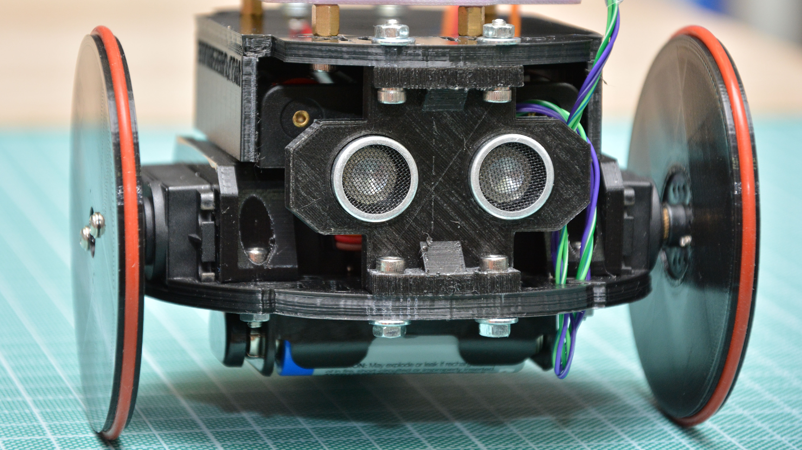

# Arlok  
## Arduino Robot with MakerUNO - 3D-print it yourself!

Arlok is the second version of [AR.L.O.](https://github.com/Cyb3rn0id/AR.L.O.) made to be compatible with the [MakerUNO](https://makeruno.com.my/) board.  

## Buy a PCB  
Making the PCB on PCBWay will support my work, but you need to subscribe to PCBWay first: you can do it using [my invite link](https://www.pcbway.com/setinvite.aspx?inviteid=355653&from=settorezero2020).  
The you can let you make the [PCB on PCBWay](https://www.pcbway.com/project/shareproject/ARLOK_arduino_robot.html)
