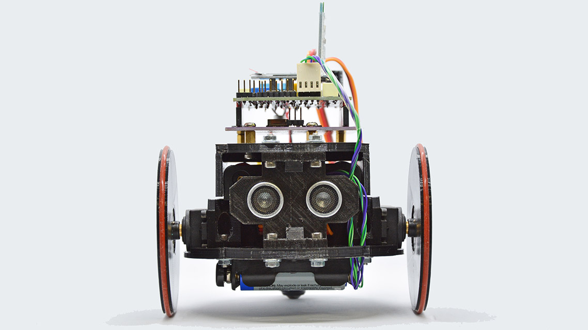

# Arlok  
## Arduino Robot with MakerUNO - 3D-print it yourself!

Arlok is the second version of [AR.L.O.](https://github.com/Cyb3rn0id/AR.L.O.) made to be compatible with the [MakerUNO](https://makeruno.com.my/) board.  

## Buy a PCB  
Making the PCB on PCBWay will support my work, but you need to subscribe to PCBWay first: you can do it using [my invite link](https://www.pcbway.com/setinvite.aspx?inviteid=355653&from=settorezero2020). Then you can let you make the [PCB on PCBWay](https://www.pcbway.com/project/shareproject/ARLOK_arduino_robot.html)

## What materials are needed?
There is a [Google Spreadsheet](https://docs.google.com/spreadsheets/d/1E60JlRyjGpX6OEBXnhZLZwZUzDe8-Zud6jBREFa6QfA/edit?usp=sharing) with all materials needed for the robot. For Italian Users only are also listed pages of italian shops where they can buy parts.  
In the [docs folder](./docs) there is the simple BOM (only parts used for the PCB).

## Assembling instructions
Assembling is very easy. You need only some 12mm M3 screws for attaching the parts.In the [STL folder](./stl) are located all parts you can 3Dprint by yourself. All parts does not need supports, so are very easy to print even with a cheap 3d-printer. An [exploded view](./media/arlok_3d_exploded.stl) shows how parts have to be placed. Other informations are reported for the wheel and the ball-caster in the [stl folder readme](./stl).

## Code examples
See in the [Arduino folder](./arduino) for code examples or write your own using one of the provided example as base!

## Connections
In the following table are showed Arduino UNO to ARLOK shield connections. Pinout is reported also the parallel version [AR.L.O.](https://github.com/Cyb3rn0id/AR.L.O.).  
If a cell is empty, means that pin is free to use and reported on a dedicate header. The interrupt column shows the interrupt number associated with the pin, but is reccomended to use *digitalPinToInterrupt(Pin)*

| Arduino PIN | AR.L.O. (Arduino UNO) | ARLOK (MakerUNO)                          | Notes                    | Interrupt |
|:------------|:----------------------|:------------------------------------------|:-------------------------|:----------|
| (empty)     |                       | Not available                             | The unused pin near IOref|           |
| IORef       |                       | Not available                             |                          |           |
| Reset       | Reset Button          | Reset Button                              |                          |           |
| 3.3V        |                       |                                           |                          |           |
| 5V          |                       |                                           |                          |           |
| GND         |                       |                                           |                          |           |
| GND         |                       |                                           |                          |           |
| Vin         |                       | Not available                             | unused on MakerUNO       |           |
| A0          | Trimmer VR1           | Trimmer VR1                               |                          |           |
| A1          |                       |                                           |                          |           |
| A2          |                       |                                           |                          |           |
| A3          |                       |                                           |                          |           |
| A4          | Don't use if OLED!    | Not available                             | Shared with SDA          |           |
| A5          | Don't use if OLED!    | Not available                             | Shared with SCL          |           |
| D0/RX       | UART RX > COMM RX     | UART RX > COMM RX                         |                          |           |
| D1/TX       | UART TX > COMM TX     | UART TX > COMM TX                         | Through voltage divider  |           |
| D2          | Sonar - Echo          | Pushbutton 1                              | MakerUNO 'button'        | 0         |
| D3          |                       | Sonar - Echo                              |                          | 1         |
| D4          |                       | Sonar - Trigger                           |                          |           |
| D5          |                       | Pushbutton 2                              |                          |           |
| D6          | Pushbutton 1          |                                           |                          |           |
| D7          | Pushbutton 2          |                                           |                          |           |
| D8          | Sonar - Trigger       | Buzzer (on MakerUNO)                      |                          |           |
| D9          | ServoMotor - Right    | ServoMotor - Right                        |                          |           |
| D10         | ServoMotor - Left     | ServoMotor - Left                         |                          |           |
| D11         |                       |                                           |                          |           |
| D12         |                       |                                           |                          |           |
| D13         |                       |                                           |                          |           |
| GND         |                       |                                           |                          |           |
| ARef        |                       |                                           |                          |           |
| SDA         | OLED SDA              | OLED SDA + Grove + I2C header             | Shared with A4           |           |
| SCL         | OLED SCL              | OLED SCL + Grove + I2C header             | Shared with A5           |           |

### Connections considerations
- On ARLOK shield some pin are not reported on the PCB (such as the IOref and the unused pin near it, A4 and A5), so you can use fewer male headers.
- On both ARLOK and AR.L.O., A3 is used in some sketches as seed for random number generator initialization; so, if you want to use A3, change the code.  
- On ARLOK all free digital pins are reported on EXT header along with 5V and ground, and the 3 free analog inputs are reported on 3 separate headers having power supply each while on on AR.L.O. free digital pins are reported on 2 headers: EXT2 (D11, D12, D13) and EXT1 (D3, D4, D5) and the analog inputs are reported to simple pads.

### Links
- [ARLOK pictures](https://tinyurl.com/arlokpictures)
- [AR.L.O. video](https://www.youtube.com/watch?v=O_3CUWvaW3k)
- [ARLOK bluetooth remote example](https://www.youtube.com/watch?v=ISU3L3CCWP8)
