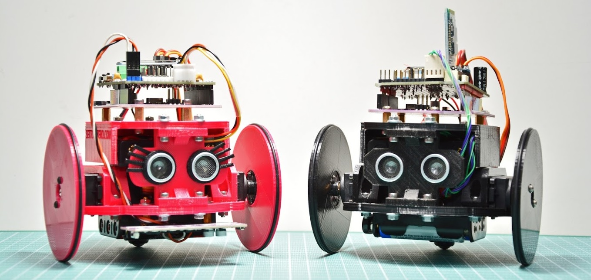

# Arlok
## Arduino Robot with MakerUNO - 3D-print it yourself!

ARLOK is a simple educational (STEM) Robot based on Arduino UNO with parts printed in 3D and all easy-available components.   
  
ARLOK is cheap, cute and easy to assemble and program. There are some programming examples that will make this robot moving around avoiding obstacles, following a line on the floor or let you control it using your cellphone with Android app (source code provided too).  
  
ARLOK is the second version of [AR.L.O.](https://github.com/Cyb3rn0id/AR.L.O.) made to be compatible with the [MakerUNO](https://makeruno.com.my/) board. So it's better use a MakerUNO but you can use also an Arduino UNO (in this case you'll need some longer headers for the shield connections).  

## Materials needed
- List of parts to be 3D-printed: [stl folder](./stl).  
- BOM in the docs folder: [Bill-Of-Materials](./docs/BOM.md).  

## Assembling
I've prepared a detailed step-by-step guide and a video on youtube: all infos are located in the [docs folder](./docs/assembly.md).  
  
🇮🇹 C'è anche la [guida in italiano](./docs/assembly_ita.md). Nella guida è anche linkato un video che illustra il montaggio passo-passo

## Code examples
See in the [Arduino folder](./arduino) for code examples or write your own using one of the provided example as base!

## Troubleshooting
See [Troubleshooting guide](./docs/troubleshooting.md)  

### Other Links
- [All ARLOK videos on Youtube](https://tinyurl.com/arlokplaylist)
- [ARLOK pictures](https://tinyurl.com/arlokpictures)
- [ARLOK on no. 253 of Italian Magazine "Elettronica IN"](https://www.elettronicain.it/prodotto/n-253-aprile-2021/?tracking=5f004a6ba8be7)
