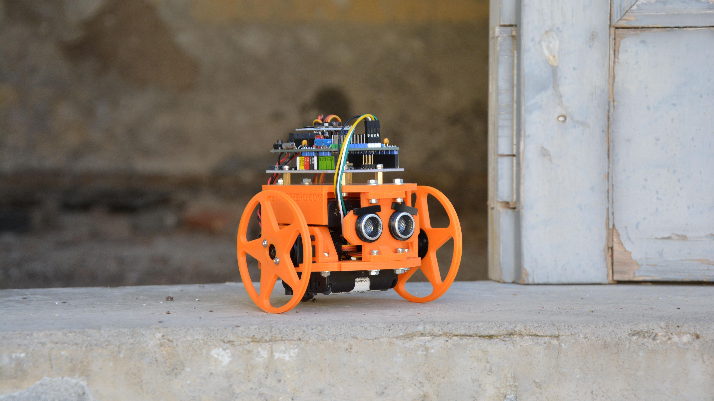

# Arlok
## Arduino Robot you can 3D-print it yourself!

Arlok is a simple educational Robot based on Arduino Uno with parts printed in 3D and all easy-available components. 3D-printed parts are big, easy to manipulate and printed even by cheap 3D-printers. Arlok is highly customizable: you can change wheels and tires, supports, powering systems and give Arlok an expression too! Arlok is cheap, cute and easy to assemble and program. There are some programming examples that will make this robot moving around avoiding obstacles, following a line on the floor or let you control it using your cellphone with an Android app (source code of app provided too!).  
  
## What you need for build an Arlok
- [Bill Of Materials](./docs/BOM.md). 
- [3D-printed parts](./cad/stl).  
 
## Assembling
Follow the step-by-step guide: [[:uk: ENG](./docs/assembly.md)] - [[:it: ITA](./docs/assembly_ita.md)]

## Code examples
See in the [Arduino folder](./arduino) for code examples or write your own using one of the provided example as base!

## Mods and Upgrades
- Powering Arlok from a LiPo Battery: [[:uk: ENG](./docs/lipo_mod.md)]  [[:it: ITA](./docs/lipo_mod_ita.md)]
- Hacking a servo for continuous rotation: [[:uk: ENG](./docs/servo_mod.md)]  [[:it: ITA](./docs/servo_mod_ita.md)]

## Troubleshooting
[Troubleshooting guide](./docs/troubleshooting.md)  

## Links
- [Greta Galli review](https://www.youtube.com/watch?v=CbPGWd9I_mA)
- [Aperitech about ARLO (first ARLOK rev)](https://www.youtube.com/watch?v=JS_QYEIMfNo)
- [All ARLOK videos on Youtube](https://tinyurl.com/arlokplaylist) 
- ARLOK on no. 253 of Italian Magazine "Elettronica IN": [EXCERPT](https://www.elettronicain.it/wp-content/uploads/prog_copertina/arlook_il_robot_per_tutti.pdf) -   [MAGAZINE ISSUE](https://www.elettronicain.it/prodotto/n-253-aprile-2021/?tracking=5f004a6ba8be7)
- ARLOK partecipated to the [2020 Maker Faire European Edition](https://makerfairerome.eu/it/espositori/?edition=2020&exhibit=3409) - Stand E57, Project P253
- ARLOK partecipated to the [2022 Maker Faire European Edition](https://makerfairerome.eu/it/espositori/?edition=2022&exhibit=2220093) - Pavillon D.19
- Maker Faire 2022 [Interview by "uno scemo qualunque"](https://www.youtube.com/watch?v=RNEsY1jSlT4&t=576s)
