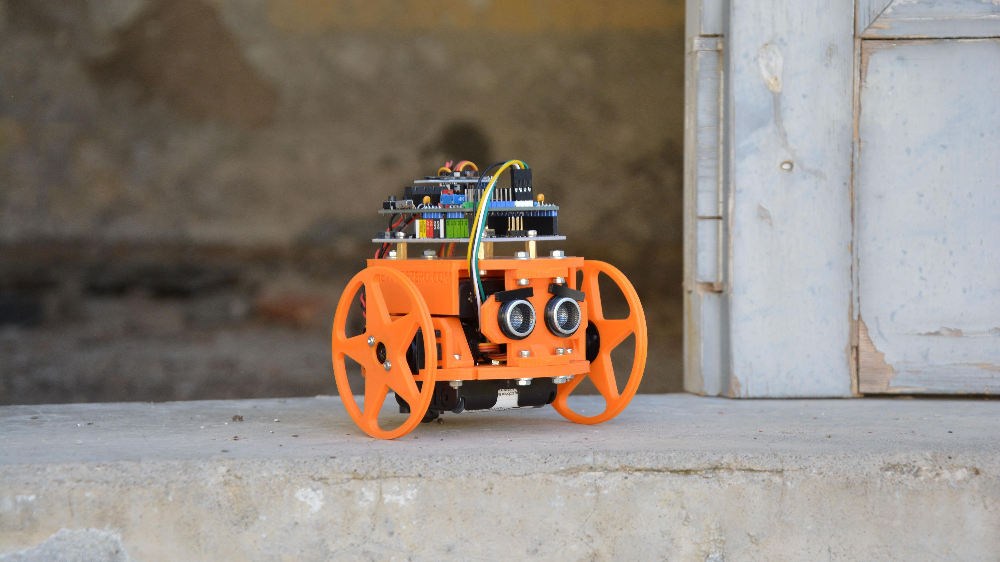

# Arlok

## Arduino Robot you can 3D-print it yourself!

Arlok is a simple educational Robot based on Arduino Uno with parts printed in 3D and all easy-available components. 3D-printed parts are big, easy to manipulate and printed even by cheap 3D-printers. Arlok is highly customizable: you can change wheels and tires, supports, powering systems and give Arlok an expression too! Arlok is cheap, cute and easy to assemble and program. There are some programming examples that will make this robot moving around avoiding obstacles, following a line on the floor or let you control it using your cellphone with an Android app (source code of app provided too!).  

## What you need for build an Arlok

- Bill Of Materials: [[:uk: ENG](./docs/BOM.md)]   [[:it: ITA](./docs/BOM_ita.md)] 
- [3D-printed parts (version 1)](./cad/v1)
- [3D-printed parts (version 2 - still preliminary)](./cad/v2)
  
Please note: version 1 and version 2 parts are not compatible each other!  

## Version 1 vs Version 2  

First Arlok version is from 2020: it was designed during Covid-19 pandemy (the very first version of the robot was called AR.L.O.). At ther time I used Tinkercad that allowed me to teach something new to my sons during the lockdown. In 2024 I started to design a new version using OnShape by PTC, mantaining the same concept design and adding some features such like a battery display and a new kind of ball-caster, but the 3D printer I had at time didn't allowed me to make some things I had in my mind. In 2025 I bought a new 3D-printer so I started to design the new version more seriously. Version 2 is here but is still a preliminary version: I added the final STEP and STL files but actually I hadn't much time for writing an assemblying tutorial like I done for the first ARLOK revision.  
  
Differencies between version 1 and version 2:
  
- The Tamiya 70144 ball-caster is no longer needed: I designed a foot for using a classic 2.5x4.5 furniture ball-caster you can find on Amazon: [sponsored link](https://amzn.to/42y9IiS). Anyway the Tamiya Ball-Caster can be used if you already have it but you must print a simple adapter you can find in both stl and step folders
- Wheels are slightly bigger and larger and are made for using only TPU printed tires: so no o-rings are needed but you need to know how to properly print TPU on your 3D-printer
- Different design for all parts: sonar and switch pillars now are larger and they cover the empty spaces giving a cleaner appearance
- Redesigned the whole chassis with the usage of a single 18650 LiPo cell in mind so, in the V2 there is no room for AA-size battery holders
- Added the possibility to use 2 18650 in parallel using the bracket for dual batteries
- Added an 1S battery display on a side
- Added a proper placement for the TP4056 (protected) 1S battery charger (tested both micro-usb and usb-c types)
- Added a proper placement for the SX1308 boost converter
- Added placement for an XL6009 boost converter (also for the XL6019 but this one cannot be used since it requires an higher input voltage, 5V)
- Added the possibility to use an VL53L0X TOF sensor instead of ultrasonic one
- Changed dimensions for allowing to use screws that will not pop-up from panels
- Changed placement of some parts for giving Arlok more stability
- Added groves for embedding nuts in some points
- Added holes and slots in certain points for passing cables in a cleaner way
- Added vent-holes for servos and boost converters
- Added handles on top for carrying Arlok more safely
- Added a further plate on top of the handles for having more expansion possibilities: plates allows the positioning of a 400-points breadboard (82x55 like this: [sponsored link](https://amzn.to/4uJOeeZ))
- Added a pedestal: you can leave Arlok on top of this pedestal for making maintenance/tuning/upgrade or simpy for showing it or allowing it to rest...

## Assembling

The Version 1 has a step-by-step guide assembly guide: [[:uk: ENG](./docs/assembly_v1.md)] - [[:it: ITA](./docs/assembly_ita_v1.md)]  
The Version 2 still doesn't have an assembly guide

## Code examples

See in the [Arduino folder](./arduino) for code examples or write your own code using one of the provided example as base!

## Mods and Upgrades

- Powering Arlok V1 from a LiPo Battery: [[:uk: ENG](./docs/lipo_mod.md)]  [[:it: ITA](./docs/lipo_mod_ita.md)] (Arlok V2 can be only powered from a LiPo)
- Hacking an analog servo for continuous rotation: [[:uk: ENG](./docs/servo_mod.md)]  [[:it: ITA](./docs/servo_mod_ita.md)]

## Troubleshooting

[Troubleshooting guide](./docs/troubleshooting.md)  

## Links

- [Greta Galli review](https://www.youtube.com/watch?v=CbPGWd9I_mA)
- [Aperitech about ARLO (first ARLOK rev)](https://www.youtube.com/watch?v=JS_QYEIMfNo)
- [All ARLOK videos on Youtube](https://tinyurl.com/arlokplaylist) 
- ARLOK on no. 253 of Italian Magazine "Elettronica IN": [EXCERPT](https://www.elettronicain.it/wp-content/uploads/prog_copertina/arlook_il_robot_per_tutti.pdf) -   [MAGAZINE ISSUE](https://www.elettronicain.it/prodotto/n-253-aprile-2021/?tracking=5f004a6ba8be7)
- ARLOK partecipated to the [2020 Maker Faire European Edition](https://makerfairerome.eu/it/espositori/?edition=2020&exhibit=3409) - Stand E57, Project P253
- ARLOK partecipated to the [2022 Maker Faire European Edition](https://makerfairerome.eu/it/espositori/?edition=2022&exhibit=2220093) - Pavillon D.19
- Maker Faire 2022 [Interview by "uno scemo qualunque"](https://www.youtube.com/watch?v=RNEsY1jSlT4&t=576s)
- ARLOK (v2) will partecipate to the [2026 Maker Faire Caserta](https://caserta.makerfaire.com/maker/entry/12/)
