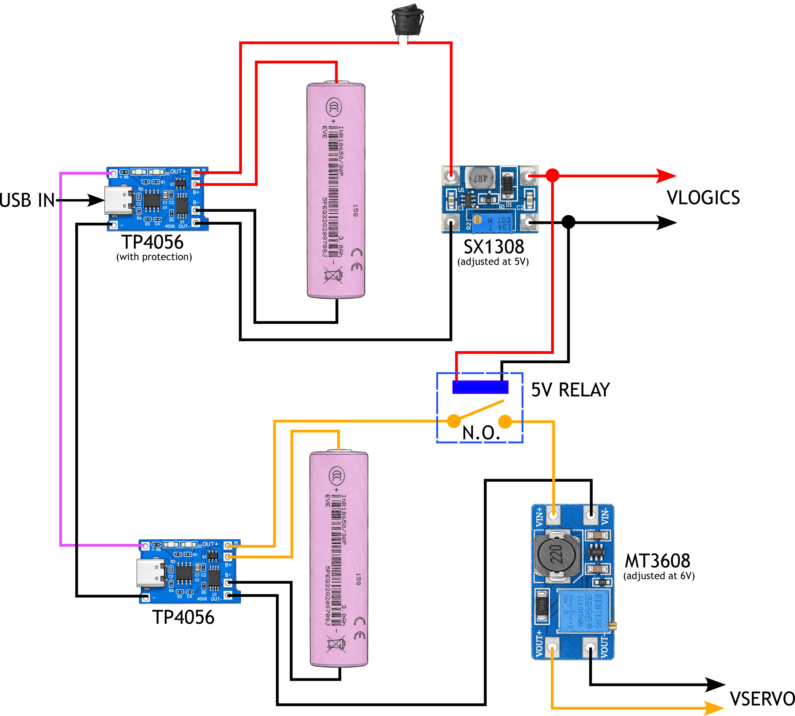

## Huskylens demo

I'm using the first Huskylens model ([SEN0305](https://wiki.dfrobot.com/sen0305/)) in this example, not the new (2) version. In order to make this demo working I made two puppets having the face of *Hide The Pain Harold* and *Mr. Bean* : I printed the face on paper using the printer and I attached them to a Maker Faire Puppet. I prepared a PDF with faces to print in a 2D paper printer and all other parts: this stuff along some instructions, is contained in the [props](props/) folder here.  

I programmed the Huskylens for detecting the face of *Hide The Pain Harold* as `ID1` and *Mr. Bean* as `ID2`. I'll show you how to do this. In the Arduino Code I will make Arlok moving by following only *Harold* even if it can recognize *Mr Bean*.  

## Libraries

In this example I used the **U8G2** library for the OLED display instead of the _Adafruit_SSD1306_. You can install the U8G2 library directly from Arduino IDE.  

You must install the Huskylens library manually: unfortunately is not available for installing it directly from Arduino IDE. I'll show you how to do it the simple way:

First Download the whole [Huskylens Repository](https://github.com/HuskyLens/HUSKYLENSArduino/tree/master) by clicking on the 'Code' button and then 'Download ZIP':

You will obtain a file called _HUSKYLENSArduino-master.zip_. Extract the ZIP file. Once extracted you'll notice there is a further _HUSKILENS.zip_ file : leave it as is (don't extract it!). 

Open Arduino IDE. Click _Sketch -> Include Library -> Add library from a zip file_:

Now point to the _HUSKILENS.zip_ file you obtained previously:

All done! If you're working on Windows, you'll notice you've an _HUSKYLENS_ folder in the _Documents/Arduino/libraries_ folder.

## Huskylens Initial Configuration

Huskylens has to be configured for streaming data over I2C:

1) Power the Huskylens (I usually do this by connecting it via USB)
2) Turn the wheel to the right until you find `General Settings` and click the wheel
3) Go on `Protocol Type`, click the wheel
4) Select `I2C`. Click the wheel 
5) Turn the wheel to the left, click on `Save & Return` 
6) *Do you want to save data? YES*

Now the Huskylens will communicate through I2C : 

- Blue = SCL
- Green = SDA
- Red = +5V 
- Black = GND 

## Program the Huskylens for detecting multiple faces

We will use the *face recognition*: it works also with printed (2D) faces. We will program it for detecting more than one face and we will use puppets contained in the [props](props/) folder.

> Note 1: When nothing is learned (Huskylens is not programmed for recognizing something) a small cross appears at center of the display. In other words: when you see the cross at display center, means Huskylens is not programmed for detecting objects.

> Note 2: If cross doesn't appear, and then Huskylens is programmed for detecting some object(s), and you want to remove this program: click the button on the right of the Huskylens (not the wheel, but the button on the opposite side): a writing `Click again to forget` appears. If you click the right button again, first the countdown reaches 0, you'll delete actual objects learned.

1) Use the wheel for going to `Face Recognition`
2) Click the wheel for select this mode
3) Click the wheel again and keep it pressed: this action will enter the setup menu for the current selected mode
4) Move the wheel and select `Learn Multiple`: a slider appears for activating this mode: move it to the right and click the wheel
5) Move wheel to the left and select `Save & Return`
6) *Do you want to save Data? Yes*
7) Put the face you want to save as first ID in front of camera, having the cross at center of the face. Be sure there is proper illumination. We will use the "Hide The Pain Harold" face as first ID
8) A white square (called _bounding box_) will appear around the face with the `face` writing on top
9) Click the right button to save this face. Now, first than countdown reaches zero, press again the right button to learn the second face
10) The first learned face now has a blue bounding box and the `ID:1` writing
11) Put the second face in front of camera and press the right button
12) You can continue to making Huskylens learn other faces following this method
13) After you pressed the right button for storing the last face, let the countdown go to zero to exit

The name to a face ID can be assigned only over serial at startup and is not stored in the Huskylens: the example program does this.
  
Every face/object recognized from the camera will produce, over communication line, a string having X,Y value as the center of the bounding box, and W,H as Width and Height of the boundig box. Detecting X and Y we can know how the object is moving in front of camera (we will use only horizontal movement, X). Detecting Width and Height of the bounding box we can know if the object is near or far from camera (we will use only object width, W). Assuming a central position of the object, associated with a 'standard' width, we can assume object is far if the width detected id smaller than the 'standard' width.

## Powering

Huskylens draws about 900mA and it's necessary to have two separate power supply to function properly. I used two separate 18650 LiPo, each one having his own TP4056 (protected) for charging and a boost module. This is the schematic I made:

