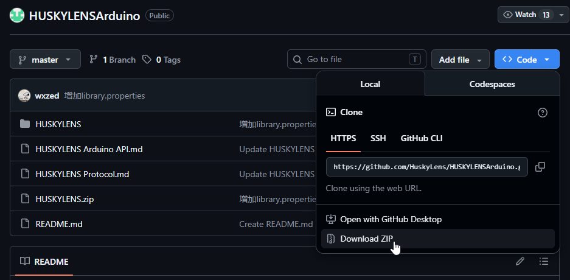
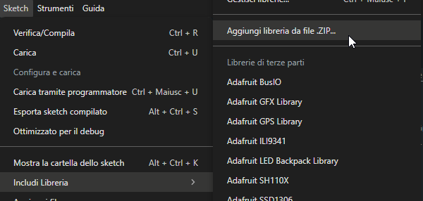
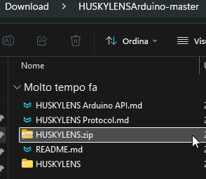

## Huskylens demo

I'm using the first Huskylens model ([SEN0305](https://wiki.dfrobot.com/sen0305/)) in this example, not the new (2) version. In order to make this demo working I made two puppets having the face of *Hide The Pain Harold* and *Mr. Bean* : I printed the face on paper using the printer and I attached them to a Maker Faire Puppet. I prepared a PDF with faces to print in a 2D paper printer, this stuff is in the [props](props/) folder  

I programmed the Huskylens for detecting the face of *Hide The Pain Harold* as `ID1` and *Mr. Bean* as `ID2`. I'll show you below ho to do this. Then in the Arduino Code I will make Arlok move by following only *Harold* even if it can recognize *Bean*.  

## Libraries

In this example I used the **U8G2** library for the OLED display instead of the Adafruit_SSD1306. You can install the U8G2 library directly from Arduino IDE.  

You must install the Huskylens library manually: unfortunately is not available for installing directly from Arduino IDE. I'll show you how to do it the simple way:

First Download the whole [Huskylens Repository](https://github.com/HuskyLens/HUSKYLENSArduino/tree/master) by clicking on the 'Code' button and then 'Download ZIP':

You will obtain a file called _HUSKYLENSArduino-master.zip_. Extract the ZIP file. Once extracted you'll notice there is a further _HUSKILENS.zip_ file : leave it as it is (don't extract it!). 

Open Arduino IDE. Click _Sketch -> Include Library -> Add library from a zip file_:

Now point to the _HUSKILENS.zip_ file you obtained first:

All done. If you're working on Windows, you'll notice you've an _HUSKYLENS_ folder in the _Documents/Arduino/libraries_ folder.

## Huskylens setup

Huskylens must be set to communicate over I2C:

- Power the Huskylens (I usually do this by connecting it on USB)
- Turn the wheel to the right until you find `General Settings` 
- Click the wheel 
- Go on `Protocol Typ`e, click the wheel 
- Select `I2C`. Click the wheel 
- Turn the wheel to the left, click on `Save & Return` 
- *Do you want to save data? YES*

Now the Huskylens will communicate through I2C : 

- Blue = SCL

- Green = SDA

- Red = +5V 

- Black = GND 

## Program the Huskylens

We will use the *face recognition*: it works also with printed (2D) faces. Choose at least one face to detect: it will be the face that Arlok will follow. Anyway I'll show you how to detect more than one face.

Use the wheel for going to `Face Recognition`

Click the wheel for select this mode

> Note: when nothing is learned a small cross appears at center of the display

Now click the wheel again and keep it pressed: this action will enter the setup menu for the current selected mode.

Now I choosed to learn more than one face (even if the second face is only detected in my example and not followed) so I choosed the *Learn Multiple* option: move the wheel and select `Learn Multiple`: a slider appears for activating this mode: move it to the right and click.

Now go to the left and select `Save & Return`. *Do you want to save Data? Yes*

> Remember what I said first: there must be the cross at center of the display, if the cross doesn't shows means the Huskylens has already learned something so you could want to delete it: you can do this clicking the button on the right: a writing `Click again to forget` appears. If you click the right button again, first the countdown reaches 0, you'll delete actual things learned.

Put the face you want to save in front of camera, having the cross at center, be sure there is proper illumination. 

> If you want to follow my exact example, print pdf file from the props folder, cut 2 faces and use the prop of Hide The Pain Harold as first face and Mr Bean as second one.

A white square will appear around the face with the `face` writing. Click the right button to save this face. Now, first than countdown reaches zero, press again the right button to learn another face. The first learned face now has a blue square around and the `ID:1` writing. Put another face in front of camera and press the right button. You can continue to learn other faces following this method. Let the countdown go to zero to finish.

The name to a face ID can be assigned over serial: the example program does this.

Every face/object recognized from the camera will produce, over communication line a string having X,Y value as the center of the square, and W,H as Width and Height of the square. 
