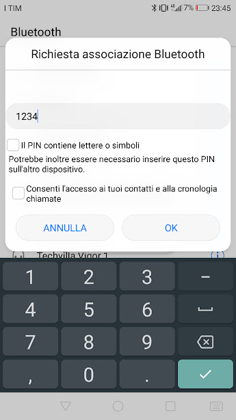

## Bluetooth Remote

Arlok is moved using an app on an Android device that sends serial commands over Bluetooth. For this example is needed an **HC-05** or an **HC-06** Bluetooth module. Android app + source code are provided here.

## Bluetooth module attachment

Please pay attention to Bluetooth module attachment! Align `RX` of the module with `TX` on the silkscreen and so on. Usually module must go with chips and antenna toward the left side of the robot:

Remember to detach the module while loading sketch on Arduino! Bluetooth module and Arduino Serial port share the same data line!

## Summary

1) [Differencies between Bluetooth Modules](#hc05vs06)
2) [Changing Bluetooh module name](#changename)
   1) [on HC-05](#hc05name)
   2) [on HC-06](#hc06name)
3) [Pairing module to the phone](#pair)
4) [Upload the code](#code)
5) [Use the ARLOK App](#app)
6) [Use Bluetooth Electronics](#kwl)

###  Differencies between HC-05 and HC-06 

Things in which those module differs:
- On HC-05 for going in `AT` command mode, you must press the button on the module during the powering. HC-06 works always in `AT` mode. `AT` mode is used for giving configuration parameters
- The `AT` command mode baud rate of the HC-05 is **38400** while the normal mode works at **9600**. The HC-06 works always at **9600**
- HC-05 responds `OK` after sending `AT` string in AT mode for indicating the module is in AT mode, HC-06 does not respond to the simple `AT` string but requires full commands
- On HC-05, for setting the module name you must use `AT+NAME=[name]` while HC-06 don't want the `=` symbol: `AT+NAME[name]`
- Usually HC-05 module has a button on the board for entering the AT mode, HC-06 don't have a button.
- HC-05 can work in Master or Slave mode (=default) giving an AT command, HC-06 is hardwired in slave mode. For ARLOK only slave mode is used, so you can use both modules.

###  Changing the Bluetooth module name

First Connect the bluetooth module (HC-0x where x=5 or 6) to an USB adapter capable to work at 3.3V : in this phase leave the USB adapter disconnected from the computer:  

- Connect HC-0x module Vcc to usb adapter +5V
- Connect HC-0x TX to USB adapter RX
- Connect HC-0x RX to USB adapter TX
- Connect HC-0x GND to USB adapter GND
- Set the USB module for working at 3.3V

> The HC-0x module need to be powered at 5V but TX/RX levels are at 3.3V. This is why you're connecting module VCC to 5V but you're setting your USB adapter for working at 3.3V

This image shows how an HC-05 module is connected to the [UART-I2C-SMBUS 2 USB adapter](https://www.settorezero.com/wordpress/bridge-da-uart-e-i2c-ad-usb/): 

If you use this module: put the power selection jumper in `3V3` position and use the remaining pin of this jumper for taking the 5V from USB for powering the bluetooth module (So, don't use the Vcc on the header).

####  Instructions for HC-05

On this bluetooth adapter, for entering `AT` mode you must press and keep pressed the button first than power the board. So press and keep pressed the button, then:  

- Connect the USB adapter to the computer
- The computer will recognize a COM port
- When red led starts to slowly flash, release the button
- Start a Serial Terminal program
- Be sure Terminal software appends `LF` and `CR` to the string. If those character are not appended, the module will not recognize commands!
- Choose the right COM port
- Set the baudrate to **38400**
- Open che connection to the COM port
- Send the string `AT+NAME=ARLOK`. The module will respond: `OK`

- Close the connection
- Remove the power from the HC-05 Module

####  Instructions for HC-06

This bluetooh adapter works always in `AT` mode.

- Connect the USB adapter to the computer
- The computer will recognize a COM port
- Start a Serial Terminal program
- Be sure Terminal software appends `LF` and `CR` to the string. If those character are not appended, the module will not recognize commands!
- Choose the right COM port
- Set baudrate to **9600**
- Open che connection to the COM port
- Be sure Terminal software appends `LF` and `CR` to the string
- Send the string: `AT+NAMEARLOK`. The module will respond: `OKsetname`

- Close the connection
- Remove the power from the HC-06 Module

###  Pairing to the phone

Pairing is necessary since the module used are NOT BLE ones. So if you don't pair the module to your phone, Bluetooth apps will not work!

- Give power to the HC-0x Module
- Take a cellular phone and turn on the bluetooth
- Search for new bluetooth devices: `ARLOK` must appear in the list

- Select this device and associate it
- the default pin is **1234** (if does not work, try **0000**)

First step is complete!

###  Upload the code

Code for Arduino is contained in the [bluetooth folder](./bluetooth).  

Pay attention: **Bluetooth module must be detached** from Arlok PCB when you connect the robot to the PC using the USB cable!  

Robot will receive commands in ASCII format:  

- 0 : motor stop
- 1 : move forward
- 2 : turn right
- 3 : move backward
- 4 : turn left
- Y : sounds the buzzer

You can use the ARLOK app on an Android phone for controlling it. Source code of the Android app is provided too.

###  Use the ARLOK App

In the [android folder](./android) is located the Android app made by Greta Galli. You must upload the `arlok.apk` file on your phone and install it.  
The `arlok.aia` is the source code of the app, made for Kodular.io.

###  Use Bluetooth Electronics

Here is a video showing this example: https://youtu.be/ISU3L3CCWP8

After you've paired the Bluetooth module with the phone, you can go further:  

- Install [Bluetooth Electronics by kewlsoft](https://play.google.com/store/apps/details?id=com.keuwl.arduinobluetooth)
- Open Bluetooth Electronics
- Some example panels are showed. When you select one, a Panel number with description is showed in the lower part of the screen.
- Select the first panel 
- Click on the save icon
- Click the button 'Load from Web Link'
- Delete the default text and write: https://www.settorezero.com/abt.kwl

> The kwl file is also contained here, in the ['other_stuff' folder](./other_stuff/)

- Press Load
- A prompt "This will overwrite all panels!" will show: don't care, press OK
- An error will be showed: don't care
- The panel for this Arlok demo is showed in the first slot and all other slots are empty

Note: for reset the previous panel click on the gears button and select 'Reset Default'. Previous panels will be reset and Arlok panel will be deleted

- In the Bluetooth Electronics panel clic the 'Connect' button
- Leave 'Bluetooth Classic' selected and press the 'Next' button
- In the paired device list, 'Arlok' must be present: Select it and press 'Connect'
- In the top screen 'Connected to: Arlok (followed my MAC address)' must be showed
- Press the 'Done' button
- Select the Arlok panel and pres the 'Run' button
- Move Arlok using the 4-way pad, sound the buzzer pressing the yellow button. The 'Distance' textbox shows the distance, expressed as cm, read by the sonar

