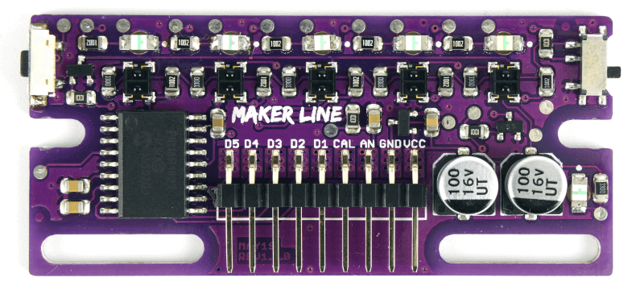
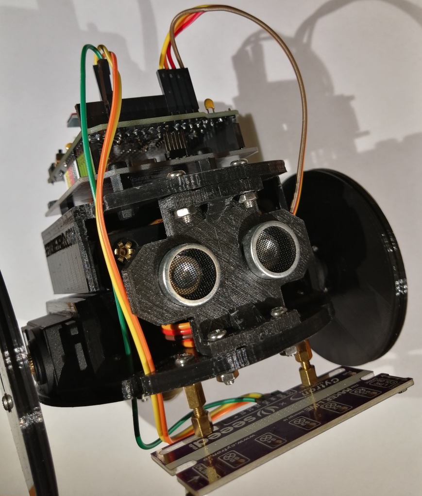

## Line Follower

The _Line Follower_ is a Robot that must be able to follow a line, usually white on a black background or black on a white background, so that the difference between the two colors is clear and easier to identify by sensors. For this example a MakerLine sensor by Cytron is needed.
Uncomment the row <kbd>#define LIPO</kbd> if you're using ARLOK powered from a LiPo Battery so you can read the battery voltage on the display. You can attach the positive lead of the battery to A2 pin for reading voltage, this pin is defined by <kbd>#define LIPO_PIN</kbd>.

### Line sensors

In this example ARLOK use a sensor board called [Maker Line](https://docs.google.com/document/d/1wZwWl72CKkajTDIyiMxSQ3bwXbWbqW0eq7rdg2MUPeU/edit?usp=sharing), that simplify the Robot software and build. This board can be set to work with a light or dark line, with a button you can calibrate the 5 sensors and you have the possibility to use 5 digital output or only one analog output to check the sensors status.  

### Sensor calibration
For the calibration there is a switch on the left and a button on the right of the board. The switch is used for selecting the line color (Black line on a bright background or White line on a dark background). After you've selected the line color with the switch, you must power the board and keep the button on the right until 5 leds will light up all in sequence: after this led will flash and you must pass slowly the sensor across the line, then press the button again.  

[This video](https://drive.google.com/file/d/19okwq5Kp5xKjQq40woOOhy_JcsLVJZ87/view) shows how perform the line sensor calibration.

### Sensor usage
On ARLOK we'll use the analog output, connected to the Arduino A2 pin. The following table shows an example of the output voltage, depending on the position of the line with respect to the sensors.

| Line not found | Left ← → Center ← → Right | All sensors on |
| :---: | :---: | :---: |
| 0 - 0.5V | 0.5V ← → 2.5V ← → 4.5V | 4.5 - 5V |

In the upper side this board have 5 leds, that show which sensor is seeing the line. This feature is great for "interpreting" the Robot's behavior, and debugging your code.

### Mounting the board

ARLOK is designed for mounting the Maker Line sensor card, in the lower part there are two slotted holes, which allow you to mount the card in the desired position. You can use spacers given with the Makerline kit. In this code example is used the A2 Arduino pin, you also need to connect the GND pin and 5V pin, between the ARLOK shield and the Maker Line. To do this, there is a specific connector on the Arlok shield.

