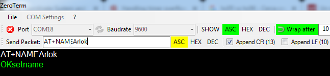
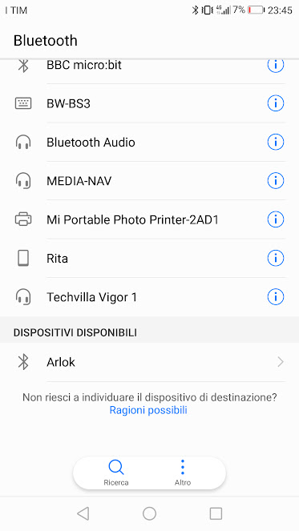

## Bluetooth Remote

Arlok is moved using an app on an android device.  
Follow those steps (assuming you're using an HC-06 Bluetooth Module):

### Change the Bluetooth module name

First Connect the bluetooth module to an USB adapter capable to work at 3.3V : in this phase leave the USB adapter disconnected from the computer:  

- Connect hc-06 module Vcc to usb adapter +5V
- Connect hc-06 TX to USB adapter RX
- Connect hc-06 RX to USB adapter TX
- Connect hc-06 GND to USB adapter GND
- Set the module for working at 3.3V

Note: The HC-06 module need to be powered at 5V but TX/RX levels are at 3.3V

- Connect the USB adapter to the computer
- The computer will recognize a COM port, the red led on the USB adapter flashes rapidly
- Start a Serial Terminal program
- Choose the right COM port and set the baudrate at 9600
- Open che connection to the COM port
- Send the string: AT+NAMEArlok
- The module will respond: OKsetname

- Close the connection
- Remove the power from the HC-06 Module
- Give the power to the HC-06 Module
- Take a cellular phone and turn on the bluetooth
- Search for new bluetooth devices: 'Arlok' must appear in the list

- Select Arlok and associate it
- the default pin is 1234 (if does not work, try 0000)

First step is complete!

### Make the App

After you've paired the Bluetooth module with the phone, you can go further:  

- install [Bluetooth Electronics by kewlsoft](https://play.google.com/store/apps/details?id=com.keuwl.arduinobluetooth)
