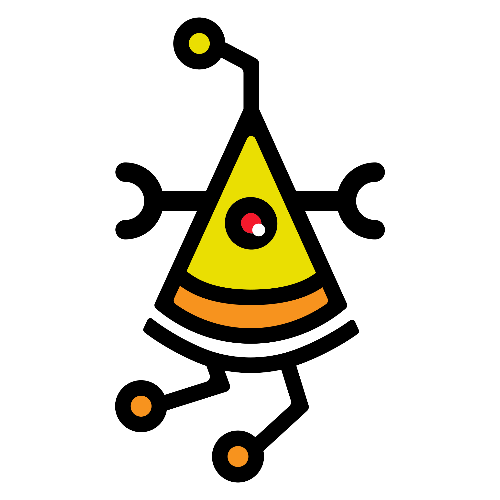
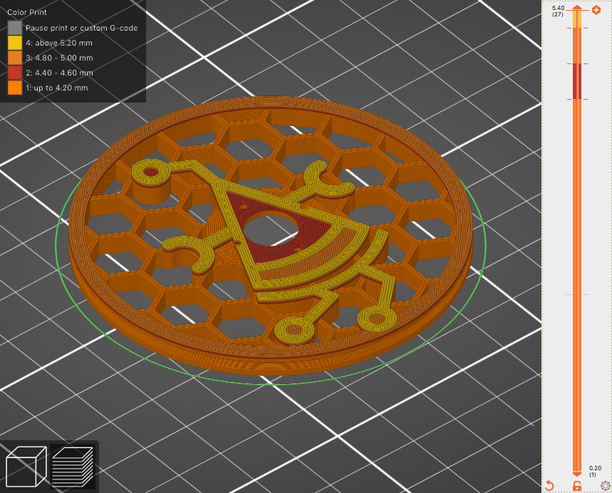
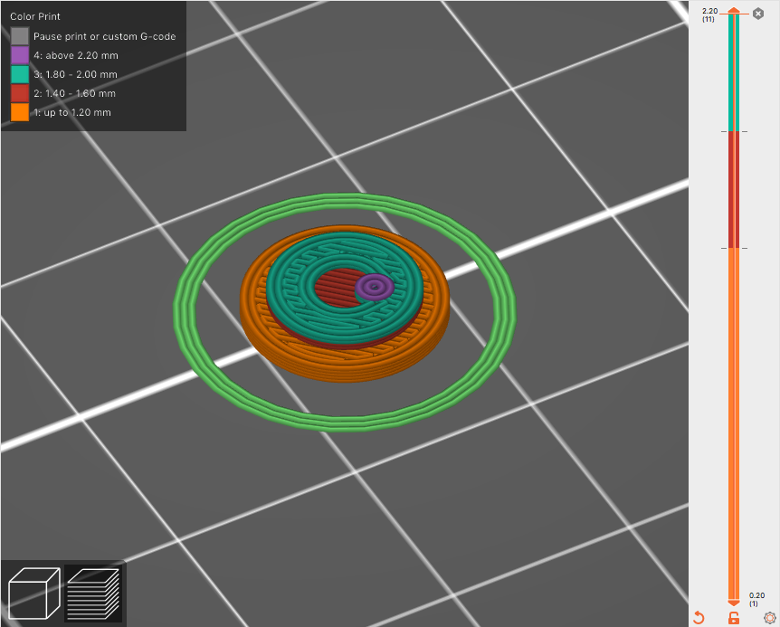

# Pizza Robotics limited edition wheel

This wheel type was designed by G. Bruno ([github](https://github.com/gbr1), [instagram](https://instagram.com/johnnyrobomeka)) for Pizza Robotics mods of Arlok robot.

You need to print two pieces for each wheel and these wheels comes awesome when you print with different colors.

## How to print

### 1. Suggested resolution and infill

+ 20% infill
+ 3 top/bottom layers
+ 1.2 wall
+ 0.2 z-axis resolution

### 2. Color scheme: main part

+ white from 0.00mm
+ yellow from 4.40mm
+ orange from 4.80mm
+ black from 5.20mm

### 3. Color scheme: cover

+ yellow from 0.00mm
+ red from 1.40 mm
+ black from 1.80 mm
+ white from 2.40mm

### 4. Final

It should be like the following!

