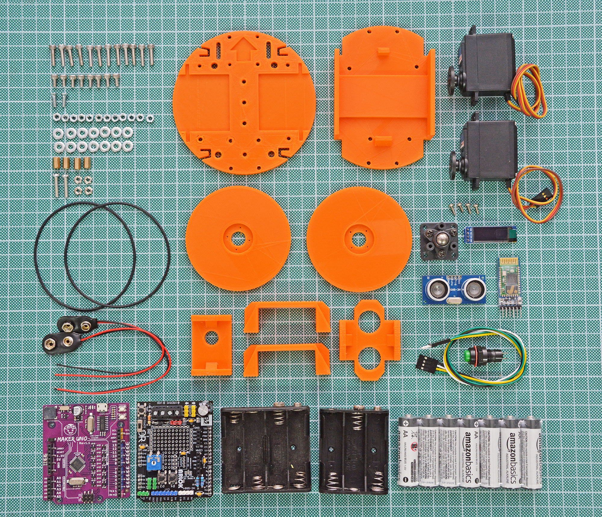
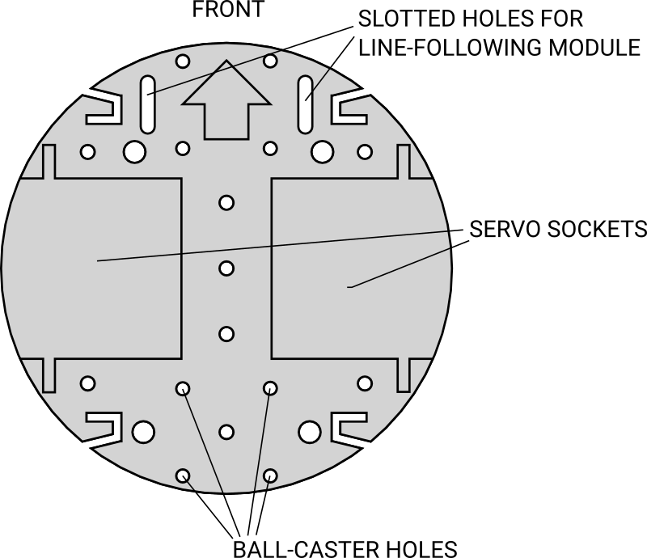
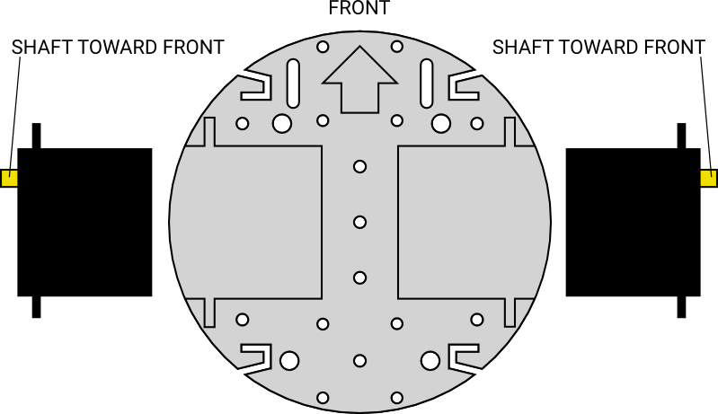
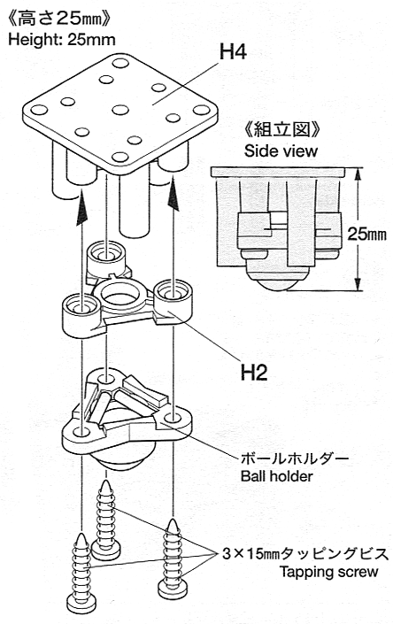
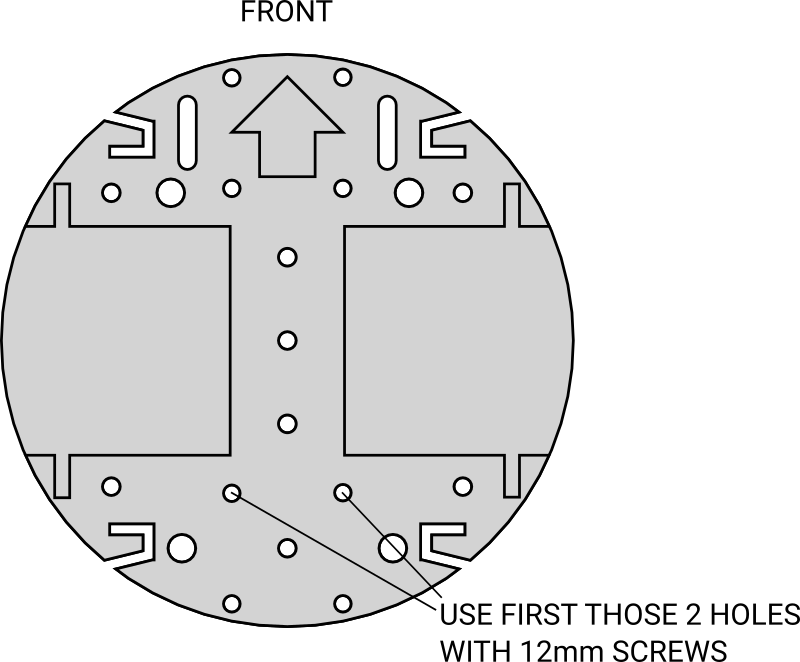
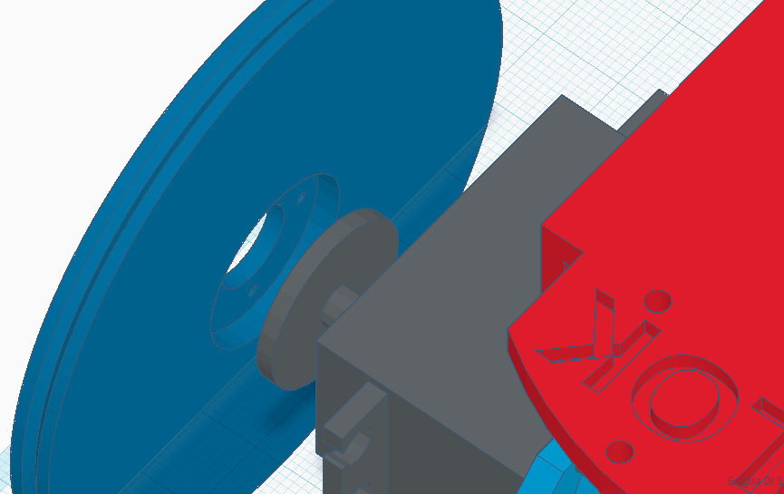
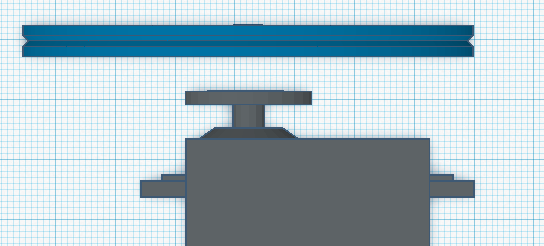

## ARLOK assembly Instructions

> Quick link to this page: [https://tinyurl.com/mountingarlok](https://tinyurl.com/mountingarlok)  

> 🇮🇹 For italian users: this guide is also available in italian language: [assembly - ITA](assembly_ita.md)  

> When you see the screw measure in millimeters: this is the length of the threaded part (without the head).

There is a [video on youtube](https://youtu.be/yHwYimkA6Dw) showing the assemblying process. It's in italian language but video is very useful for understanding how certain parts must be placed correctly.

  

### Preliminary Steps

- You've 2 servo having 360° rotation OR you have already modified the 2 servos for the continuous rotation (see [Servo modification guide](servo_mod.md) or see [this video on youtube](https://www.youtube.com/watch?v=_Ubauj75d9E))
- You've already assembled the Shield
- Take also some little cable ties: will turn useful for making a clean job.  

Open the [ARLOK exploded view](./media/arlok_3d_exploded.stl) in a new window: this will turn useful for seeing how parts must be placed/oriented.  

Take the base (`arlok_plate_bottom`): Front-top side is the one with the arrow and the 2 slotted holes. We will start from this piece.

You will use the big holes or the lateral "C" grooves for passing the cables.   

### STEP 1
Attach the 3AA-battery holder on the bottom of the plate using the 2x M3 8mm countersunk screws.  
Screws will go from bottom (head in the battery holder) to top so the nut will be on top of the base. Use 2 washers.
This battery will only power the logic board.

### STEP 2
Place the two servos in the grooves. The shaft will toward the front. 

Place the brackets on the servos (`arlok_servo_bracket`). Attach servo brackets them using 4x M3 12mm Allen screws from top (head in the bracket) to bottom. On the bottom use 4x M3 washers and 4x M3 nuts.

Using a small piece of papertape write on Servo connectors "Right" and "Left" for remembering later where connects servo cables on the PCB. 

### STEP 3
Assemble the Tamiya 70144 ball-caster according instructions in the ball-caster box: You must assemble the ball-caster in the 25mm version:

[Here are the ball-caster full instructions](../media/instructions/ball_caster_instructions.png)

### STEP 4
Attach the ball-caster on the bottom of the base, rear part. Use 2x M3 12mm Allen screws from top to bottom in the 2 holes near the center leaving free the 2 holes near the base border. 

Nuts in the bottom part without washers. Use 2x M3 nuts provided with the ball-caster kit.

### STEP 5
Attach the rear pillar (`arlok_pillar_hole_##`): the one with the hole for the switch. The hole must go to the lower side. Use 2x of the longest M3 screws provided in the ball-caster kit (those screws have the lenght of threaded part of about 14.5mm): screws will pass from the  pillar through the base and ball-caster.
Nuts goes in the lower part. Don't use washers, use 2x M3 nuts provided with the ball-caster kit.

### STEP 6
Sold 2 small piece of wire on the round pushbutton (or the lever switch). Put the button in the hole of the rear pillar and fix it using his bolt. This pushbutton will detach the power from the 4AA batteries used for the servos. Check with a multimeter the pushbutton: must be in OFF position (opened).

### STEP 7
Attach the pillar for the ultrasonic sensor (`arlok_pillar_sonar`) to the base using 2x M3 12mm Allen screws from top to bottom. Nuts in the lower part. Use washers.

### STEP 8
Straight the male pinheader of the ultrasonic sensor and attach 4 female to female jumpers (wire must be long at least 12-15cm). Mind the colors you've used for the ultrasonic sensor signals: red wire for the `Vdd`, black for `Gnd` and other 2 different colors for `echo` and `trigger`. I've prepared an italian video-guide for using certain male/female 4pin cable, maybe this can be another idea for you for attaching the sonar: [https://youtu.be/iF_R0xU8K-4](https://youtu.be/iF_R0xU8K-4)

### STEP 9
Insert the ultrasonic sensor in the pillar with cables on the bottom.

### STEP 10
Take the top plate (`arlok_plate_top`). The front-top part is the one with the ARLOK writing on it. Put 4x M3 6mm screws in the central holes having the Arduino layout, from bottom to top. Screw the 4x M3 8 or 10mm female/female spacers on the screws.

### STEP 11
Place the 4AA battery holder on the servo brackets. It's no needed to attach it since will be held from the lateral wings of the top plate. Sold one wire of the pushbutton to the negative wire of the 4AA battery holder. Be sure pushbutton is in the OFF position (eventually check with a multimeter) and then put in 4 AA batteries.

### STEP 12
Put the top plate on the bottom assembly, with the ARLOK writing in the same direction of the ultrasonic sensor. Fix the top plate using 4x M3 12mm screws from the bottom of pillars through the plate and 4x M3 bolts with washers.

### STEP 13
Put the MakerUNO on the spacers. Attach the board using the 4x M3 6mm screws.

### STEP 14
- Attach the ARLOK shield on top of the MakerUNO
- Put the `JP1` jumper in the `VDD` position (logic powered from the 3AA battery)
- Attach the wires from the ultrasonic sensor on the `HC-SR04` header respecting signals/colors.
- Attach the 2 servo connectors on the Servo headers respecting the LEFT-RIGHT arrows and the wire colors (orange=`S`, red=`+`, brown=`-`)
- Move the small `POWER` switch on the shield toward the OR logo (OFF position if you soldered it correctly without covering the RESET writing).
- Put 3 AA batteries in the battery holder
- Put the 2 wires from the 3xAA battery holder in the `VDD` screw terminal, red wire in the `+`. If you see the `L1` led turning on, move the `POWER` switch on the shield in the opposite position.
- Put the 2 wires from the 4xAA battery holder in the `VSERVO` screw terminal, red wire in the `+`. If you see servo moving, push the button/turn the lever.

### STEP 15
- Attach the round servo hub in the groove of the wheels using 2 self-tapping screws coming from the servo kit. Screw heads will go outside (part of the wheel without the grove). The notch of the hubs will go toward the servo shaft. Follow the pictures:

  

- Attach the wheels to the servos using the small self-tapping screws from the servo kit through the horn.

### STEP 16
Place the O-Ring on the wheels.

### STEP 17
Load first the [explorer example](../arduino/explorer). Read the readme document in the folder for doing the setup procedure. [Here is an italian guide about the setup procedure](https://youtu.be/qzJxrcuSvpU).