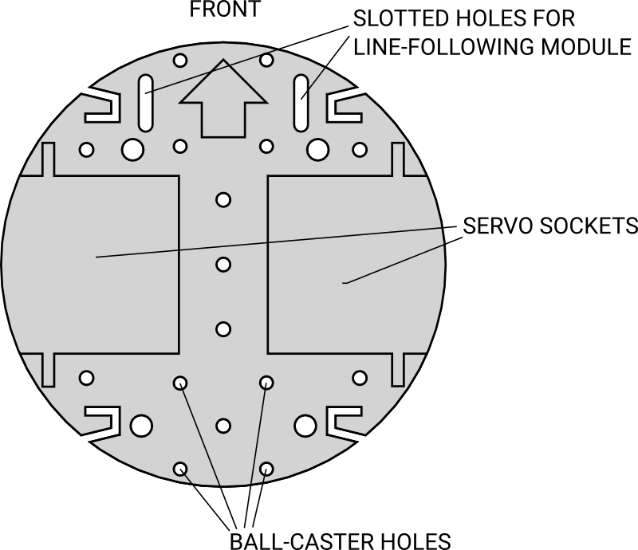

## ARLOK assembly Instructions

### Preliminary Steps

- You've already modified the 2 servos for the continuous rotation
- You've already assembled the Shield

Take the base (`arlok_plate_bottom`): Front-top side is the one with the arrow and the 2 slotted holes. We'll start from this piece. 

You will use the big holes or the lateral "C" grooves for passing the cables.   
Take also some little cable ties: will turn useful for making a clean job.  

There is an [exploded view](./media/arlok_3d_exploded.stl) of Arlok: this will turn useful for seeing how parts are placed.  

When you see the screw measure in millimeters: this is the length of the threaded part.

### STEP 1
Attach the 3AA-battery holder on the bottom of the plate using the 2x M3 8mm countersunk screws.  
Screws will go from bottom (head in the battery holder) to top so the nut will be on top of the base. Use 2 washers.
This battery will only power the logic board.

### STEP 2
Place the two servos in the grooves. The shaft will toward the front. 

Place the brackets on the servos (`arlok_servo_bracket`). Attach servo brackers them using 4x M3 12mm Allen screws from top (head in the bracket) to bottom. On the bottom use 4x M3 washers and 4x M3 nuts.

Using a small piece of papertape write on Servo connectors "Right" and "Left" for remembering later where connects servo cables on the PCB. 

### STEP 3
Assemble the Tamiya 70144 ball-caster according instructions in the ball-caster box: You must assemble the ball-caster in the 27mm version WITHOUT the H1 washers so the ball-caster will have a total height of about 25mm.

### STEP 4
Attach the ball-caster on the bottom of the base, rear part. Use 2x M3 12mm Allen screws from top to bottom in the 2 holes near the center leaving free the 2 holes near the base border. 

Nuts in the bottom part without washers.

### STEP 5
Attach the rear pillar (`arlok_pillar_hole_##`): the one with the hole for the switch. The hole must go to the lower side. Use 2x of the longest M3 screws provided in the ball-caster kit: screws will pass from the  pillar through the base and ball-caster.
Nuts goes in the lower part. Don't use washers, use 2x M3 nuts provided with the ball-caster kit.

### STEP 6
Sold 2 small piesce of wire on the round pushbutton (or the lever switch). Put the button in the hole of the rear pillar and fix it using his bolt. This pushbutton will detach the power from the 4AA batteries used for the servos. Check with a multimeter the pushbutton: must be in OFF position (opened).

### STEP 7
Attach the pillar for the ultrasonic sensor (`arlok_pillar_sonar`) to the base using 2x M3 12mm Allen screws from top to bottom. Nuts in the lower part. Use washers.

### STEP 8
Put 4x M3 12mm Allen screws from bottom to top in the top holes of the  pillars.

### STEP 9
Straight the male pinheader of the ultrasonic sensor and attach 4 female to female jumpers (wire must be long at least 12-15mm).
Mind the colors you used for the ultrasonic sensor signals: red wire for the Vdd, black for GND and other 2 different colors for echo and trigger.

### STEP 10
Insert the ultrasonic sensor in the pillar with cables on the bottom. If you've printed the eyelashes, insert them on the ultrasonic capsules.

### STEP 11
Take the top plate (`arlok_plate_top`). The front-top part is the one with the ARLOK writing on it. Put 4x M3 6mm screws in the central holes having the Arduino layout, from bottom to top. Screw the 4x M3 10mm female/female spacers on the screws.

### STEP 12
Place the 4AA battery holder on the servo brackets. It's no needed to attach it since will be held from the lateral wings of the top plate. Sold one wire of the pushbutton to the negative wire of the 4AA battery holder.  
Be sure pushbutton is in the OFF position (eventually check with a multimeter) and then put in the batteries.

### STEP 13
Put the top plate on the bottom assembly, with the ARLOK writing in the same direction of the ultrasonic sensor. Fix the top plate using 4x M3 bolts with washers on the screws coming from the pillars. Use washers.

### STEP 14
Put the MakerUNO on the standoffs. Attach the board using the 4x M3 6mm screws.

### STEP 15
- Attach the ARLOK shield on top of the MakerUNO
- Put the `JP1` jumper in the `VDD` position (logic powered from the 3AA battery)
- Attach the wires from the ultrasonic sensor on the `HC-SR04` header respecting signals/colors.
- Attach the 2 servo connectors on the Servo headers respecting the LEFT-RIGHT arrows and the wire colors (orange=`S`, red=`+`, brown=`-`)
- Move the small `POWER` switch on the shield toward the OR logo (OFF position if you soldered it correctly without covering the RESET writing).
- Put the 2 wires from the 3xAA battery holder in the `VDD` screw terminal, red wire in the `+`. If you see the `L1` led turning on, move the `POWER` switch on the shield in the opposite position.
- Put the 2 wires from the 4xAA battery holder in the `VSERVO` screw terminal, red wire in the `+`. If you see servo moving, push the button/turn the lever.

### STEP 16
- Attach the round servo hub in the groove of the wheels using 2 self-tapping screws coming from the servo kit. Screw heads will go outside (part of the wheel without the grove). The notch of the hubs will go toward the servo shaft.
- Attach the wheels to the servos using screws from the servo kit through the horn.

### STEP 17
Place the O-Ring on the wheels. Don't use cyanoacrilate glues.

### STEP 18
Do the motors set-up procedure. [This video will help you](https://www.youtube.com/watch?v=i7roltk-IzI)
