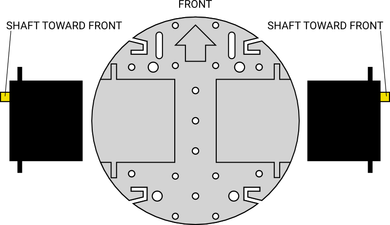
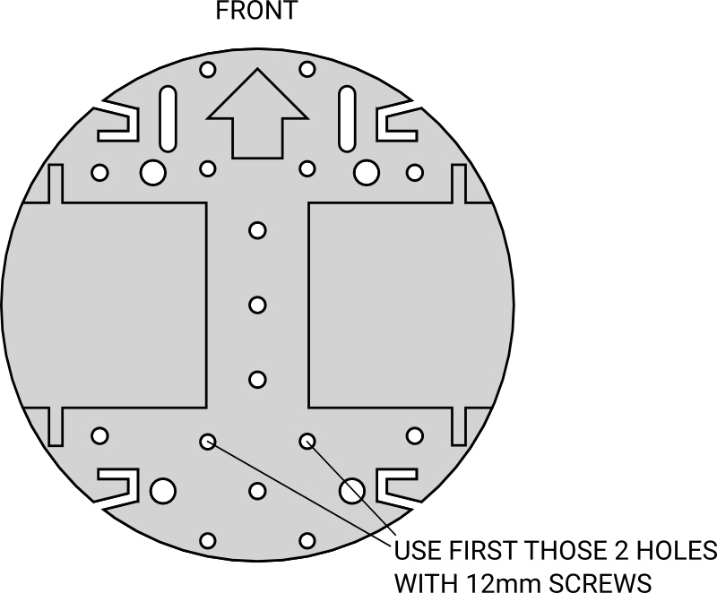
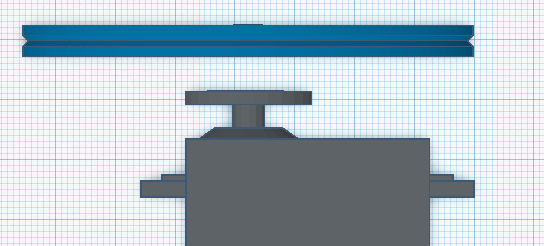

## Istruzioni montaggio ARLOK in italiano

Nota: Le misure delle viti sono espresse in millimetri e si riferiscono alla lunghezza della sola parte filettata, quindi testa esclusa

### Fasi preliminari

- Avete acquistato due servocomandi che ruotano a 360° oppure avete già modificato due normali servocomandi analogici per avere la rotazione continua (vedi [modifica dei servocomandi](servo_mod.md))
- Avete già assemblato lo shield di ARLOK
- Procuratevi alcune piccole fascette: torneranno utili per l'organizzazione dei cavi e per avere un risultato più pulito.

Aprite la [Vista esplosa di ARLOK](./media/arlok_3d_exploded.stl) in una nuova finestra: vi tornerà molto utile per vedere come vanno posizionati ed orientati i pezzi.

Prendete la base (`arlok_plate_bottom`): la parte frontale-superiore è quella con la freccia e i due slot laterali. La freccia indica dove è posizionata la "faccia" del robot, ovvero quella con le capsule ultrasuoni.

Gli incavi a forma di C o i fori più grandi possono essere utilizzati per far passare i vari cavi.

### STEP 1
Aggangiare il portabatterie per le 3 stilo sulla parte inferiore del piatto utilizzando 2 viti M3 da 8mm con testa svasata.
La testa delle viti va chiaramente nel portabatterie e la vite fuoriesce sul lato superiore della base. Il portabatterie ha difatti i fori fatti per ospitare una vite a testa svasata che, entrando nell'incavo, non urta sulle batterie. Fissate le viti utilizzando due rondelline e 2 dadi M3.  
Queste batterie sono utilizzate esclusivamente per alimentare la logica (la MakerUNO/Arduino UNO).

### STEP 2
Posizionare i servocomandi negli appositi incavi presenti nella parte superiore della base. I servocomandi vanno orientati con l'asse di uscita rivolto in aventi.

Posizionare le staffe di bloccagglio dei servo al di sopra dei servo. (`arlok_servo_bracket`). Le "ali" di fissaggio dei servo vanno appoggiate sulla parte piatta delle staffe, senza usare viti. Le staffe vanno fissate sulla base utilizzando 4 viti M3 da 12mm a testa esagonale incavata. Nella parte inferiore avvitare con 4 dadi M3, utilizzare le rondelle.

Utilizzando un po' di nastro carta, annotare sui connettori dei servo qual'è il destro e qual'è il sinistro in modo da non commettere errori quando andremo a collegare i connettori dei servo sul PCB.

### STEP 3
Montare il Ball-Caster Tamiya 70144 ball-caster seguendo le istruzioni presenti nella confezione del ball-caster. Bisogna montarlo nella versione da 27mm ma OMETTENDO le rondelle identificate come "H1". L'altezza totale del ball-caster dovrà essere all'incirca 25mm.

### STEP 4
Collegare il ball-caster alla base. Il ball caster va nella parte posteriore-inferiore. Utilizzare 2 viti M3 12mm nei due buchi più vicini al centro lasciando liberi i 2 buchi posteriori: in questi buchi andrà difatti montato anche il pilastrino posteriore, per cui per ora vanno lasciati liberi.

Le viti vanno messe dall'alto verso il basso: avvitare in basso utilizzando 2 rondelle e 2 dadi M3.

### STEP 5
Montare il pilastrino posteriore (`arlok_pillar_hole_##`): è quello con il foro all'interno del quale va messo l'interruttore. Il foro va rivolto verso il basso. Per fissare il pilastrino dovete utilizzare 2 delle viti più lunghe fornite insieme al ball caster: le viti vanno infilate da pilastrino verso il basso e devono attraversare base e ball-caster ed essere quindi avvitate con 2 dadi dal lato del ball-caster. Qui non vanno utilizzate rondelle. Utilizzate 2 dadi forniti col ball-caster.

### STEP 6
Saldare 2 piccoli spezzoni di cavo ai terminali dell'interruttore che avete scelto. Infilare l'interruttore nel foro del pilastrino posteriore e fissarlo col dado fornito insieme all'interruttore stesso. Assicuratevi che l'interruttore sia in posizione OFF, magari utilizzando un tester in modalità "continuità": poggiando i puntali ai terminali dell'interruttore non deve suonare (OFF), se il tester suona vuol dire che il pulsante è ON.

### STEP 7
Montare il pilastrino per il sensore ultrasuoni (`arlok_pillar_sonar`) nella parte frontale: utilizzare 2 viti M3 12mm a testa esagonale incassata dal pilastrino verso il basso. Avvitare in basso con 2 dadi M3 e rondelle.

### STEP 8
Inserire 4 viti M3 12mm a testa cava esagonale incassata nei 4 fori rimasti liberi nella parte superiore dei pilastrini: le viti vanno dal basso verso l'alto. Vi troverete quindi la parte filettata delle viti in alto, in posizione per accogliere la piastra superiore di ARLOK. Se le viti tendono a cadere potete utilizzare dei piccoli pezzettini di nastro carta per tenerle ferme temporaneamente.

### STEP 9
Piegare l'header del sensore ultrasuoni in modo da farlo diventare dritto. Collegare 4 jumper femmina/femmina lunghi almeno 12-15cm. Ricordate i colori che avete utilizzato per i vari segnali come scritti sul PCB del sensore, ad esempio Rosso=VDD, Nero=GND, Giallo=echo, Verde=trigger. Sceglieteli voi ma ricordatevi ad ogni pin quale colore avete associato.

Un altro sistema potrebbe essere quello di utilizzare un [cavetto da 4 terminali come questo](https://www.futurashop.it/cavi-connettori-adattatori/cavi/vari-con-connettore/cavetto-maschio-femmina-30cm-4PIN-1606-CAVOFM4P?tracking=5f004a6ba8be7): la parte femmina andrebbe collegata sul sensore ultrasuoni, la parte maschio andrebbe saldata direttamente sul PCB al posto dell'header per il sensore ultrasuoni. 

### STEP 10
Innestare il sensore ultrasuoni nel pilastrino frontale con l'header rivolto in basso. Se avete stampato le ciglia, incastratele dal davanti: sono anche utili se i buchi sono troppo larghi e lasciano muovere il sensore. Il sensore va spinto fino in fondo, fino a far toccare il quarzo sul pilastrino. Assolutamente non devono andare a filo col pilastrino altrimenti restituiscono valori sbagliati e portano il robottino a rilevare ostacoli inestistenti.

### STEP 11
Prendere la piastra superiore (`arlok_plate_top`). La parte superiore-frontale è quella con la scritta ARLOK. Mettere 4 viti M3 6mm nei fori più al centro disposti secondo il layout di Arduino. Le viti vanno messe dal basso verso l'alto e nella parte superiore, filettata, vanno avvitati 4 distanziali esagonali femmina/femmina da 10mm.

### STEP 12
Appoggiare il portabatterie per le 4 stilo al di sopra delle staffe dei servocomandi: non è necessario fissarlo/incollarlo perchè rimarrà in posizione grazie alle ali laterali della base superiore. Collegare uno dei due fili dell'interruttore al filo nero del portabatterie e isolare il punto di giunzione. Se non l'avete fatto prima: assicuratevi che l'interruttore sia in posizione OFF. Mettere le 4 batterie.

### STEP 13
Posizionare la piastra superiore sulle 4 viti che fuoriescono dai pilastrini: la scritta ARLOK va rivolta in avanti, ovvero in direzione delle capsule ultrasuoni. Bloccare la piastra superiore con 4 dadi M3 e rondelle.

### STEP 14
Posizionare la MakerUNO sui distanziali e bloccarla con 4 viti M3 6mm.

### STEP 15
- Innestare lo shield di ARLOK sulla MakerUNO
- Mettere il jumper `JP1` in posizione `VDD` (questo fa in modo che la logica sia alimentata dalle 3 batterie AA sul fondo del robot)
- Collegare i fili del sensore ultrasuoni sull'header contrassegnato come `HC-SR04` rispettando i segnali
- Collegare i connettori dei due servocomandi sugli headers rispettando l'orientamento LEFT (sinistro) / RIGHT (destro) e il colore dei fili (giallo o arandio=`S`, rosso=`+`, nero o marrone=`-`)
- Spostare l'interruttorino `POWER` dello shield verso il logo OR (=posizione OFF se lo avete saldato correttamente, ovvero senza coprire la scritta RESET)
- Mettere 3 batterie AA nel portabatterie inferiore
- Mettere i 2 fili dal portabatterie inferiore (3AA) nel terminale a vite contrassegnato come `VDD` : il filo rosso va in `+`. Se vedete il led `L1` accendersi, spostare l'interruttore `POWER` sullo shield nella direzione opposta in cui si trova
- Mettere i 2 fili dal portabatterie da 4 AA nel connettore a vite `VSERVO` : il filo rosso va in `+`. Se vedete i servocomandi muoversi o fare rumore, mettere l'interruttore sul pilastrino nella posizione opposta a quella in cui si trova.

### STEP 16
- Appoggiare le squadrette tonde dei servo nell'incavo della ruota con il perno verso il lato opposto. Guardare l'immagine per non sbagliare:

  

- Le squadrette vanno fissate alle ruote utilizzando 2 delle piccole viti autofilettanti fornite con i servo. dall'esterno della ruota verso l'interno. La ruota ha già 4 piccoli buchini: usarne solo 2 posti a 180°. Bisogna applicare molta forza con un buon cacciavite per fare in modo che le viti si creino la filettatura nella plastica della ruota e della squadretta. La parte di vite che fuoriesce non da problemi.
- Collegare quindi le ruote ai servo innestando il perno della squdretta sul perno del servo e fissarla utilizzando una vite, fornita coi servo, al centro della squadretta. 

### STEP 17
Posizionare gli O-Ring sulle ruote. E' consigliato non usare collanti, soprattutto cianoacrilato che rilascia aloni biancastri. Colle come ad esempio il bostick possono sciogliere la gomma dell'O-Ring.

### STEP 18
Caricare per primo il programma [run_simple](../arduino/run_simple). Come da descrizione riportata nel readme eseguire prima la procedura di setup per i servo: [potete seguire questo video](https://youtu.be/qzJxrcuSvpU).