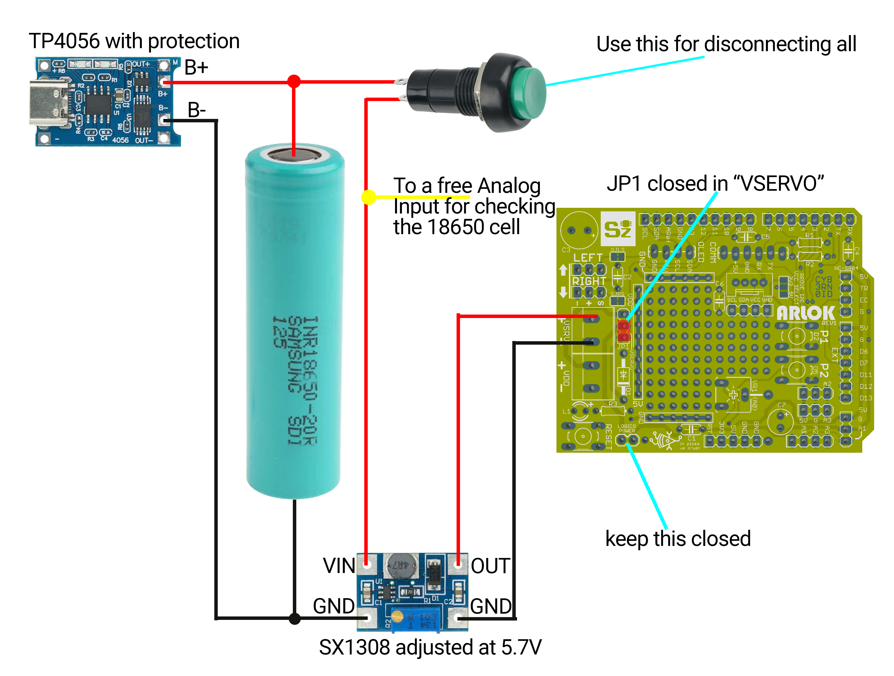

## MOD : Using LiPo Batteries

Warning: LiPo batteries can be very dangerous! Handle them with care and make this mod at your own risk!

### Preliminary stuff
  
#### You'll need:
- 18650 LiPo Battery with tabs
- an SX1308 Step-Up Converter (PCB signature is HW668)
- a TP4056 with protection for recharging the battery (or use the method you prefer for rechargingthe battery)
- 3D-print the [`arlok_18650_holder.stl`](../cad/stl/arlok_18650_holder.stl)
- additional 2 M3 screws, Allen bolt socket cap, 12mm (length of threaded part - 15mm total) + nuts
- some strong double-sided tape 

#### You'll remove:
- Battery Holder for 4AA batteries
- Battery Holder for 3AA batteries
- X2 (VDD) Screw Terminal 2pin

#### You'll not use anymore:
- Power Jumper (you can close it with a bridge)

#### Schematic

### How-to 

- Fix the 18650 battery on the bottom of the robot using the `arlok_18650_holder.stl`, screws and bolts
- Solder a red cable from the + tab of the battery to 1 pin of the round pushbutton with retain or lever switch
- Solder a red cable from the free button/switch terminal to the + Input terminal of the SX1308 module
- Solder a black cable from the - tab of the battery to the - Input terminal of the SX1308 module 
- Turn on the button/switch and check with a multimeter the SX1308 module: adjust it using the multi-turn trimmer on it for 5.6 / 5.7 volts (the Diode D1 will lower the voltage of about 0.6-0.7V)
- Turn off the button 
- Attach the SX1308 module on the top of a servo bracket using double-sided tape (or make and share your own design)
- Solder a red cable from the SX1308 + output to the + of Vservo X1 screw terminal 
- Solder a black cable from the SX1308 - output to the - of Vservo X1 screw terminal 
- (optional) Solder a cable, having a female dupont terminal, on the + Input terminal of the SX1308 module along with red cable already soldered: this can be used for checking the battery voltage reading from an Analog Input. The female dupont terminal can be connected to one free analog input terminal (A2 - you can use/take inspiration from the [explorer lipo](../arduino/explorer_lipo/) programming example)
- Set the Jumper JP1 in the `VSERVO` position

Now all the robot parts (logics and servos) will be powered from the same battery: Logics will be powered at about 5V and servo at about 5.6V.

For charging the battery you must:
- Turn off the button/switch on the back
- Attach outputs of the TP4056 module on the battery using alligator clips (or make and share your own design)
- Battery will be fully charged when blue led on TP4056 module turns on 
