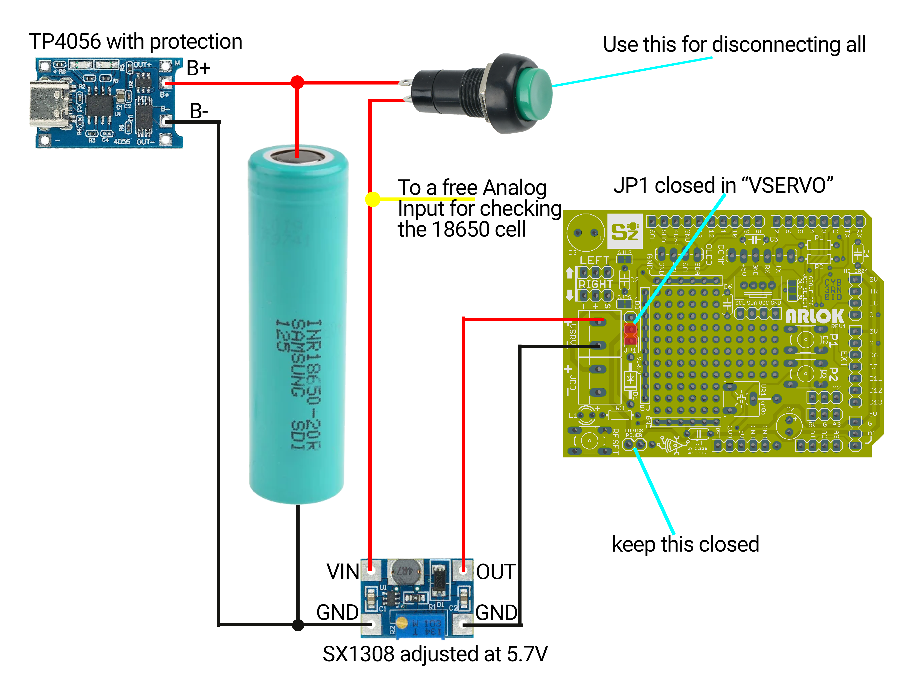

## MOD : Utilizzo batterie LiPo

Attenzione: Le Batterie LiPo possono essere molto pericolose se non vengono maneggiate e gestite correttamente! Fate questa modifica a vostro rischio!

### Operazioni preliminari
  
#### Avrai bisogno di:
- Una batteria LiPo formato 18650 munita di linguette a saldare, più alta è la capacità, più tempo funzionerà il robot
- Un [convertitore Step-Up SX1308](https://amzn.to/3L3Qqu7)
- Un caricabatterie per singola cella LiPo [TP4056 munito di protezione](https://amzn.to/3ZIwKjv) (oppure utilizza il metodo che preferisci per ricaricare la batteria)
- Stampa in 3D del pezzo [`arlok_18650_holder.stl`](../cad/stl/arlok_18650_holder.stl)
- Due viti M3, lunghezza parte filettata 12mm, + 2 dadi
- Nastro biadesivo
- Cavetti nero e rosso

OPZIONALE 
- Display con led disposti a forma di batteria ([Battery Display 1S](https://amzn.to/4ermYJs)) che indica il livello di carica di una cella Litio 1S 
- Pezzo alternativo del Plate Top [`arlok_plate_top_1sdisplay.stl`](../cad/stl/arlok_plate_top_1sdisplay.stl) che contiene sia l'incavo per incastrare il TP4056 sia la finestra laterale per incastrare il Battery Display

#### Dovrai rimuovere/dissaldare:
- Il portabatterie 4xAA
- Il portabatterie 3xAA
- I cavi dall'interruttore sul pilastrino posteriore
- (optional per non confondersi) Lo screw terminal X2 (VDD)

#### Non userai più
- L'interruttore/Il jumper "Power" (i pad devono essere chiusi permanentemente, userai il tasto sul retro per accendere tutto. Se hai utilizzato un jumper, puoi lasciare questo sempre chiuso)

#### Schema (senza display)

#### Schema (con display)

### Procedimento

- Fissa la batteria 18650 sul fondo del robot utilizzando il pezzo [`arlok_18650_holder.stl`](../cad/stl/arlok_18650_holder.stl), le viti e i dadi
- Salda un cavetto rosso dalla linguetta + della batteria ad uno dei due pin dell'interruttore sul pilastrino posteriore
- Salda un cavetto rosso dall'altro pin dell'interruttore all'ingresso + del modulo Step-Up SX1308
- Salda un cavetto nero dalla linguetta - della batteria all'ingresso - del modulo Step-Up SX1308
- Premi l'interruttore (accendi) e con un multimetro verifica l'uscita del modulo SX1308: regola il trimmer multigiro per avere in uscita circa 5.6 / 5.7 volts (il Diodo D1 provvederà ad una caduta di tensione di 0.6-0.7V). Per sicurezza puoi controllare la tensione sul catodo del diodo D1 per essere sicuri che ci siano 5V
- Premi di nuovo l'interruttore per spegnere
- Fissa il modulo SX1308 su uno dei due supporti dei servo utilizzando il nastro biadesivo (oppure crea tu, e condividi, la tua soluzione)
- Salda un cavetto rosso dall'uscita + del modulo SX1308 al terminale + del connettore a vite X1 (VSERVO) sul PCB
- Salda un cavetto nero dall'uscita - del modulo SX1308 al terminale - del connettore a vite X1 (VSERVO) sul PCB
- (opzionale) Salda un cavetto del colore che vuoi (ma non nero, nè rosso per non creare confusione), munito di connettore dupont femmina ad una estremità, all'ingresso + del modulo SX1308 insieme al cavetto che già hai saldato: questo cavetto sarà utilizzato per controllare la tensione della batteria tramite un ingresso Analogico. Il connettore dupont femmina andrà collegato ad un ingresso analogico libero (ad esempio A2 come illustrato nell'esempio [explorer lipo](../arduino/explorer_lipo/))
- Imposta il jumper JP1 nella posizione `VSERVO`

Da questo momento tutto il robot (sia la parte logica che i servocomandi) saranno alimentati dalla stessa batteria: la logica avrà una tensione di circa 5V (uscita SX1308 scalata dal diodo D1) mentre i servocomandi saranno alimentati a circa 5.6V.
L'esempio [explorer](../arduino/explorer/) contiene il codice per leggere la tensione della batteria LiPo e mostrarla sul display.

Per caricare la batteria bisognerà:  

- Spegnere il robot agendo sull'interruttore
- Collegare le uscite del modulo TP4056 sulla batteria 18650 utilizzando, magari delle clips coccodrillo (oppure crea tu, e condividi, la tua soluzione)
- La batteria è completamente carica quando si accende il led blu sul modulo TP4056

### Avvertenze:

- non caricare mai la batteria con l'interruttore acceso: ovvero non alimentare il robot e contemporaneamente caricare la batteria
- mentre carichi il robot, questo dovrebbe essere messo in un luogo sicuro, lontano da oggetti infiammabili o suscettibili di esplosione. Preferibilmente tieni in carica il robot in un contenitore a prova di esplosione
- esegui collegamenti puliti, utilizza il termorestringente per coprire le zone di alimentazione scoperte: un cortocircuito su una batteria LiPo è molto pericoloso
- tenere lontano dalla portata dei bambini
