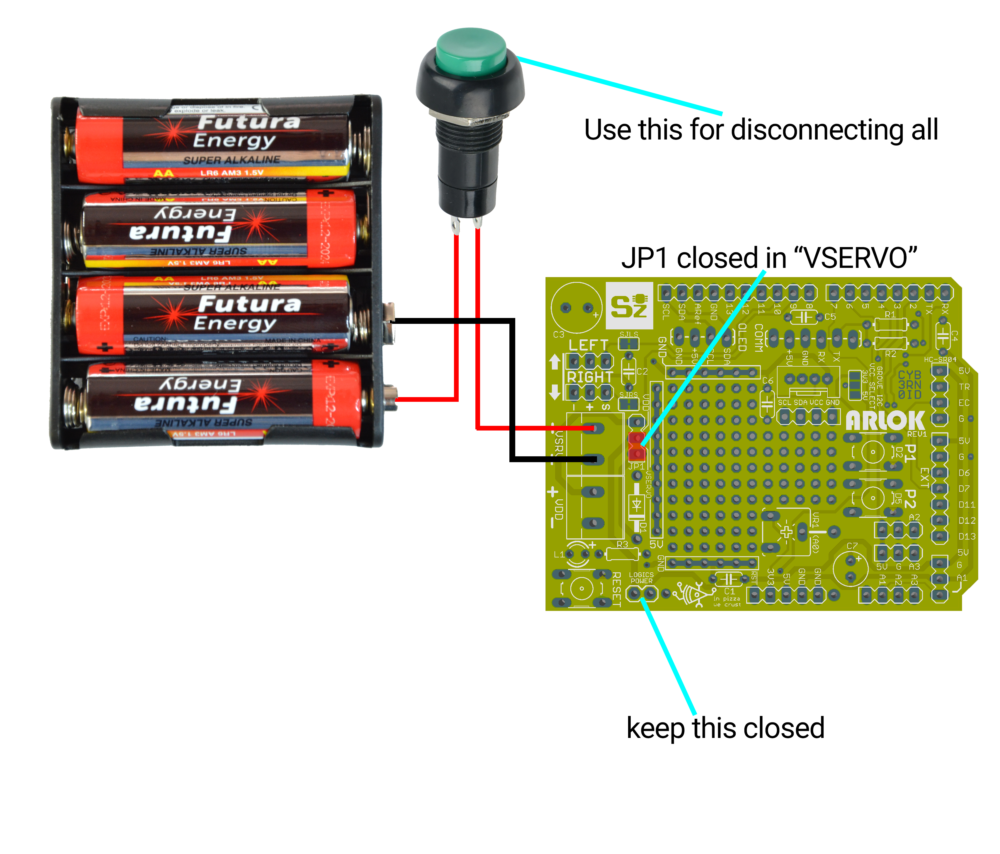

## Powering

You can power Arlok with 3 different methods:
- Using 7 AA Batteries: 4 for motors, 3 for logics (safe, adviced for kids, limited autonomy)
- Using 4 AA Batteries fot both motors and logics (cheap, not adviced, limited autonomy)
- Using a single 18650 LiPo Battery with step-up converter (rechargeable, dangerous, not adviced for kids, great autonomy)

### Using 7 AA Batteries (6V+4.5V)
This is a safe method since common batteries are used. Anyway the 4AA batteries have a limited autonomy since are used for motors and hare pretty difficult to replace since you must unscrew the top plate.
You need:
- 7 AA Batteries (not adviced NiMh rechargeable ones since are 1.2V)
- a battery holder for 4 AA batteries
- a battery holder for 3 AA batteries

The 3xAA Battery holder (4.5V) will be connected to the VDD screw terminal and will take place under the robot, near the ballcaster  
The 4xAA Battery holder (6V) will be connected to the VSERVO screw terminal through the pushbutton. This holder will take place between the top and the bottom plate  
You must put the JP1 jumper in the VDD position

### Using 4 AA Batteries (6V)
This method is cheap but not adviced.
You need:
- 4 AA Batteries (not adviced NiMh rechargeable ones since are 1.2V)
- a battery holder for 4 AA batteries

  

The 4xAA Battery holder (6V) will be connected to the VSERVO screw terminal through the pushbutton. This holder will take place between the top and the bottom plate.  
You must put the JP1 jumper in the VSERVO position and you can close the the "logics" pad

### Using a 18650 LiPo cell
See the [lipo_mod.md document](lipo_mod.md)