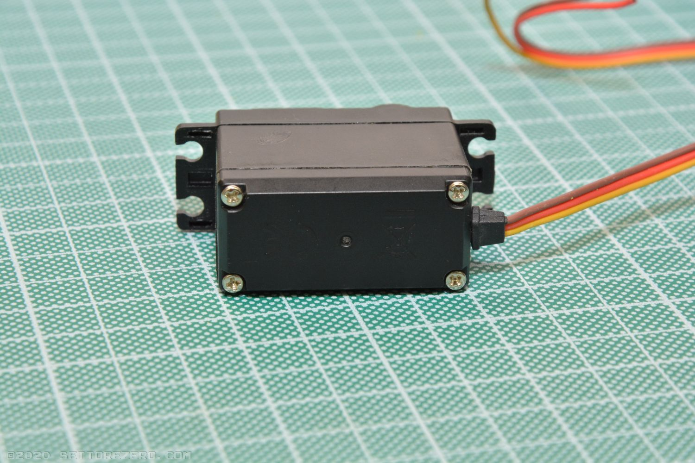
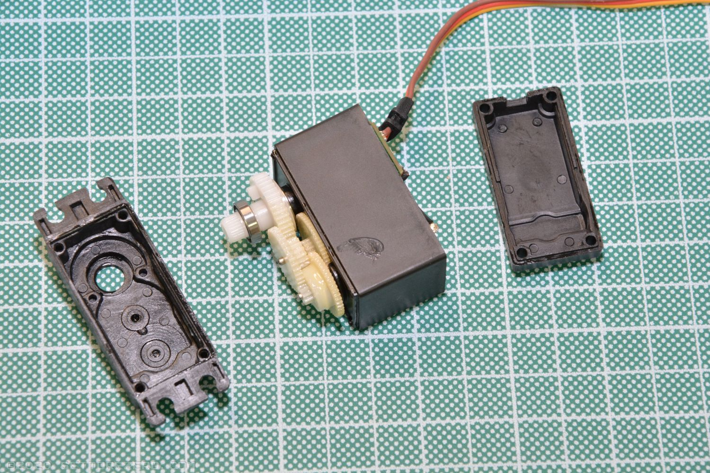
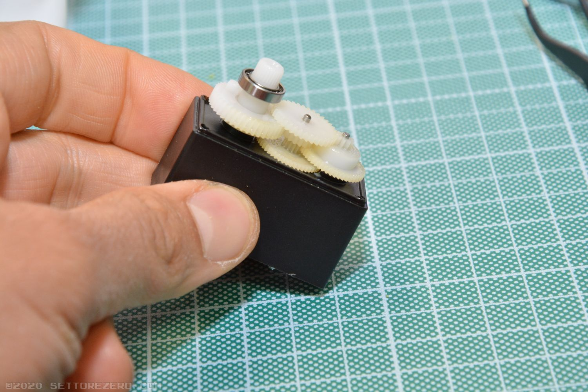
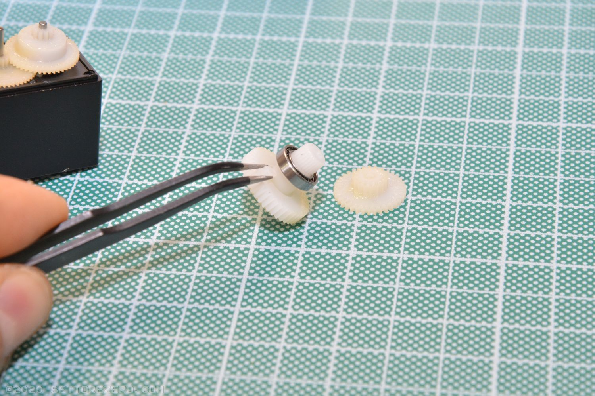
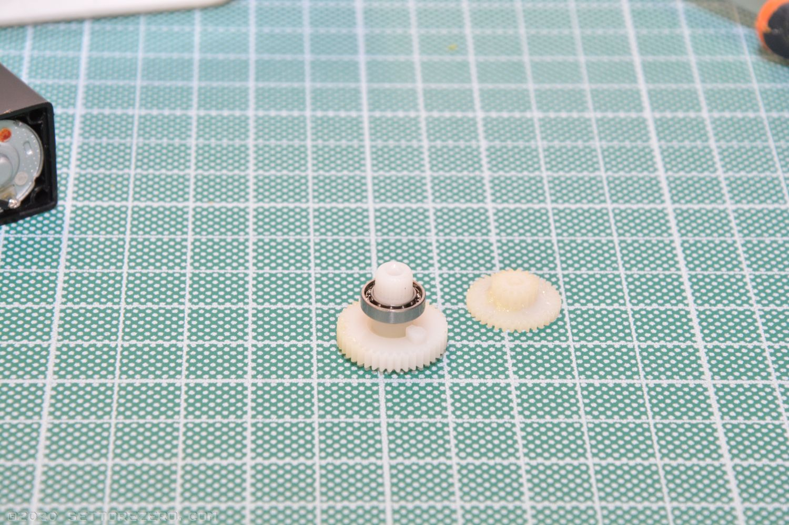
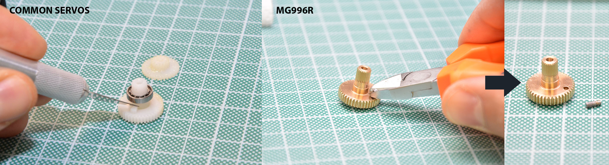
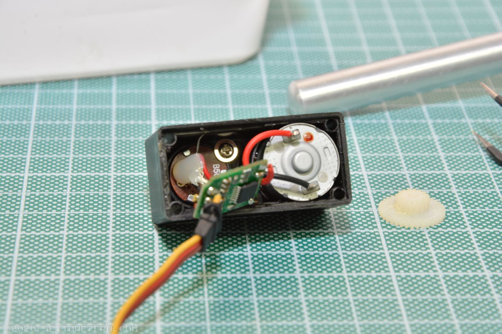
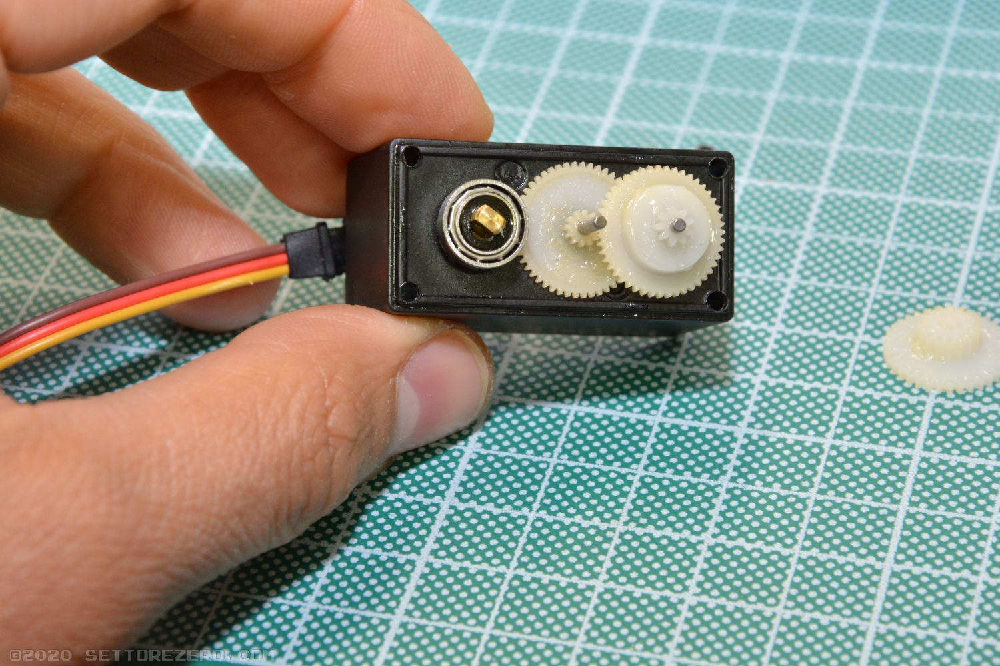

## Servo modification

This is a simple guide for modification of a standard analog servo for having the continuous rotation. Not needed if you have 360° servo.

Tools needed:

- 4 22K ¼W 1% resistors
- a lancet
- a small phillips screwdriver

Locate the 4 screw in the lower part of the servo:  

Unscrew the screws:

Disassemble the servo box:

Locate the gears:

Extract the gear with the hub and the ball-bearing on it:

Look at this gear: it has a small notch under the ball-bearing. The MG996R servo has a little metallic cilinder instead.

Gently cut-out this notch using a lancet or a small cutter. don't apply too much force. For the MG996R servo you can use a small wrench for extracting the metallic notch:

Extract the servo PCB:

In the top part of the servo there is the potentiometer hub: is the one where the gear you've previously removed was placed. Gently press the potentiometer hub backward for pushing it out:

Now you've the potentiomer and pcb out:

Desolder the cables from the potentiomer:

Arrange the 2 22KΩ resistor in this way:

Put the resistors in place of the potentiomer:

Re-assemble the servo. Do the same to other servo.

