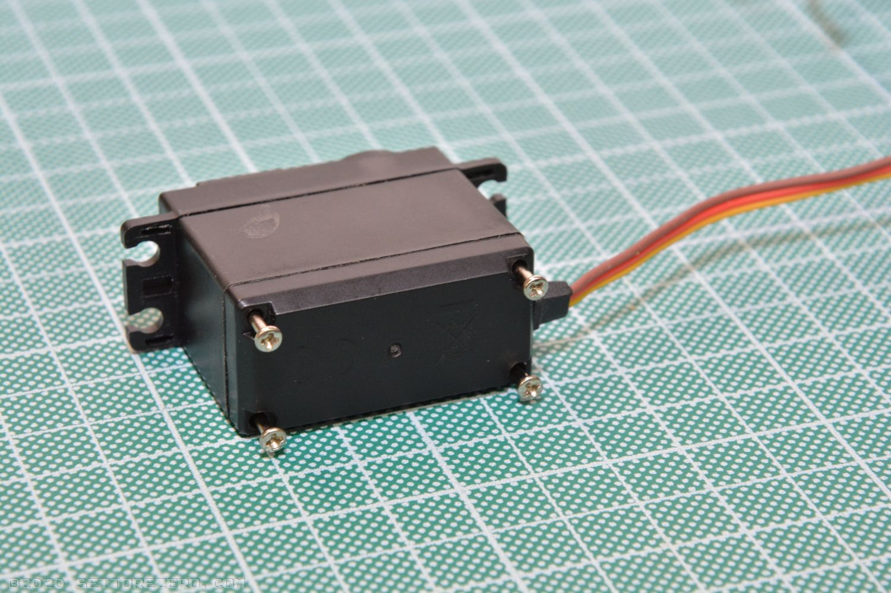
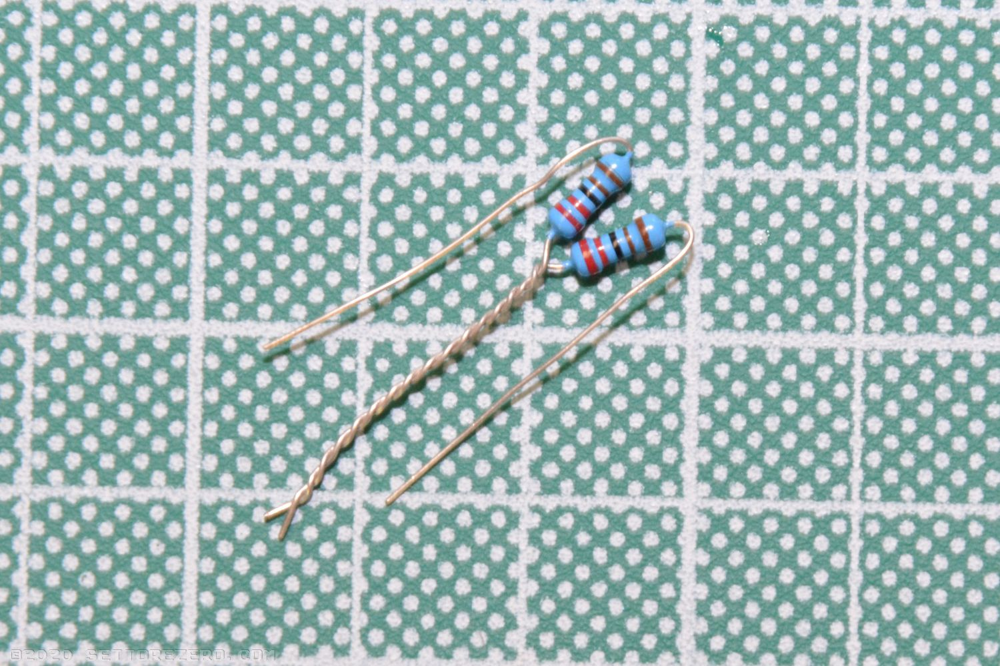
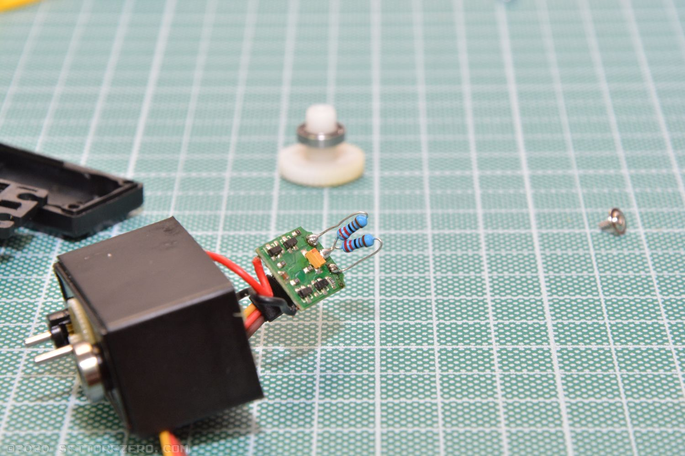

## Servo hack

This is a simple guide for hacking a standard analog servo for achieving continuous rotation. This procedudre is **not needed** if you have 360° servo.
[Here is a video](https://www.youtube.com/watch?v=_Ubauj75d9E) Showing this procedure

Tools needed:

- 4 2.2K ¼W 1% resistors
- a lancet (for plastic gears servo) or a small wrench (for metallic gears servo)
- a small phillips screwdriver
- soldering iron
- solder sucker

Locate the 4 screw in the lower part of the servo:  

Unscrew the screws:

Disassemble the servo box:

Locate the gears:

Extract the gear with the hub and the ball-bearing on it:

Look at this gear: it has a small notch under the ball-bearing. The MG996R servo has a little metallic cilinder instead:

Now you must remove this notch. For a servo having plastic gears you can gently use a lancet or a small cutter: don't apply too much force OR THE ENTIRE GEAR WILL BROKE! For the MG996R servo you can use a small wrench for extracting the metallic notch by simply pulling it upward:

Now extract the servo PCB:

In the top part of the servo there is the potentiometer hub: is the one where the gear you've previously removed was placed. Gently press the potentiometer hub backward for pushing it out:

Now you've the potentiomer and pcb out:

Desolder the cables from the potentiomer:

Arrange the 2 2.2KΩ 1% resistor in this way:

Put the resistors in place of the potentiomer:

Re-assemble the servo. Do the same to other servo.
