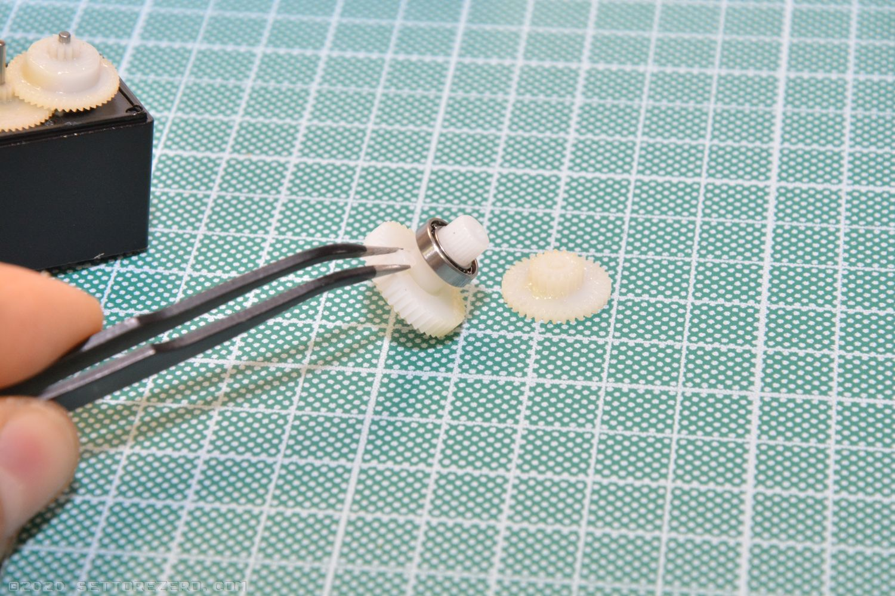
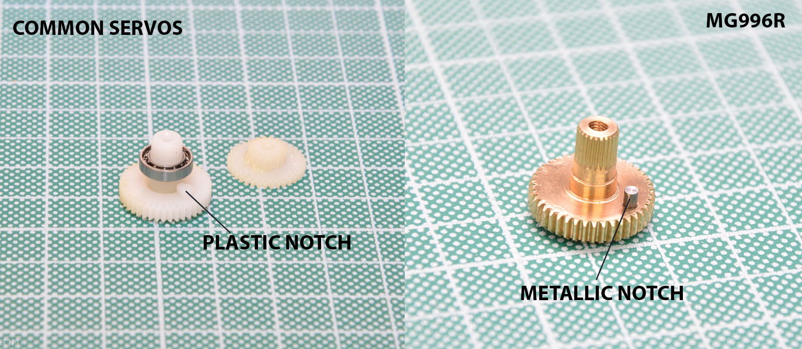
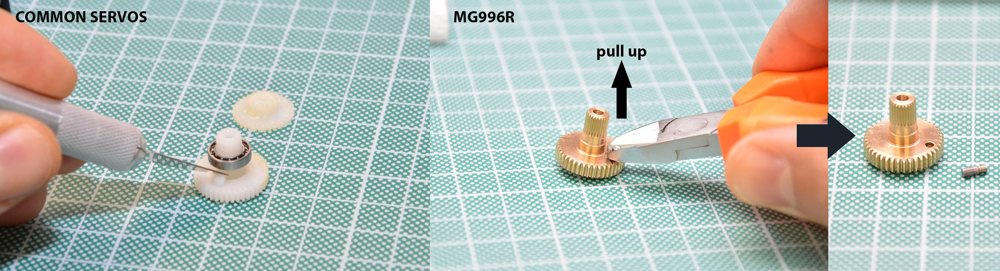
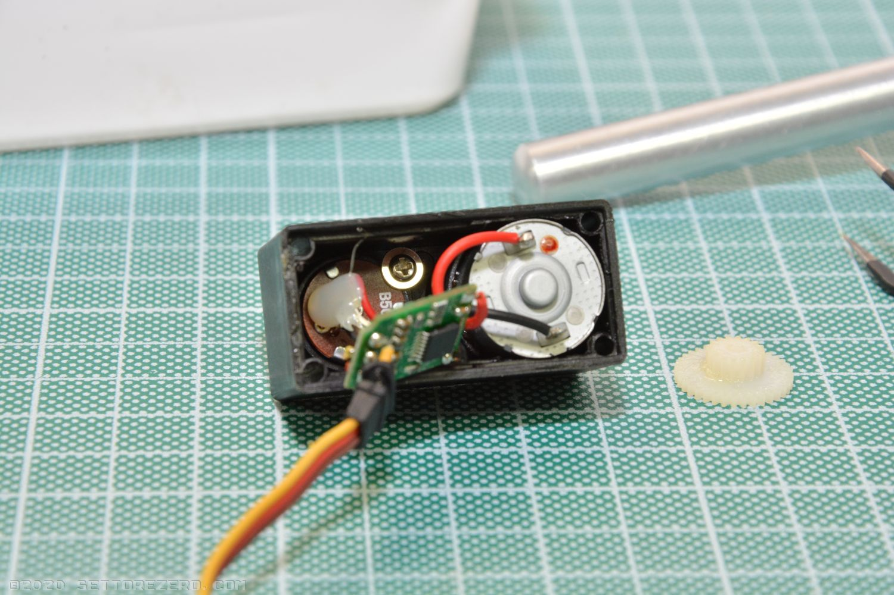
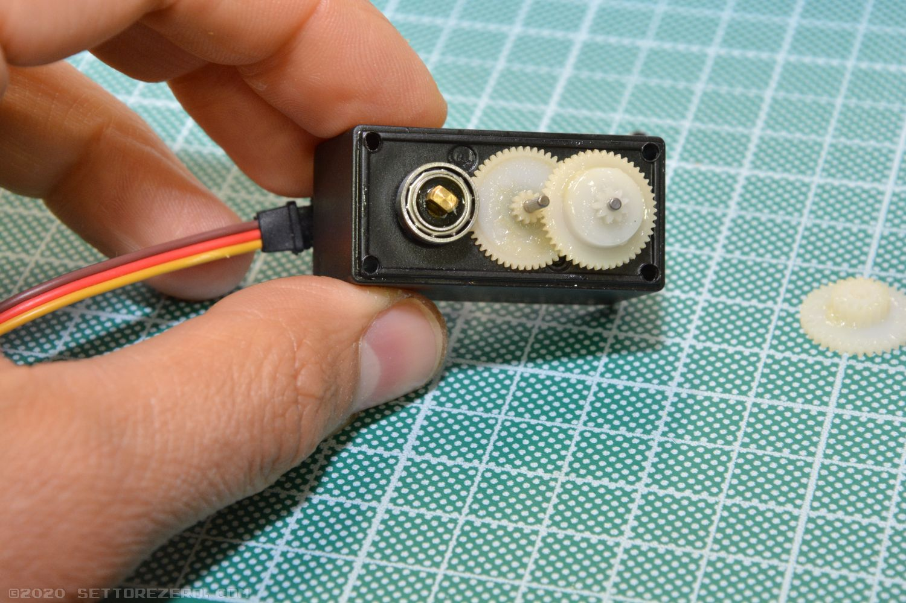
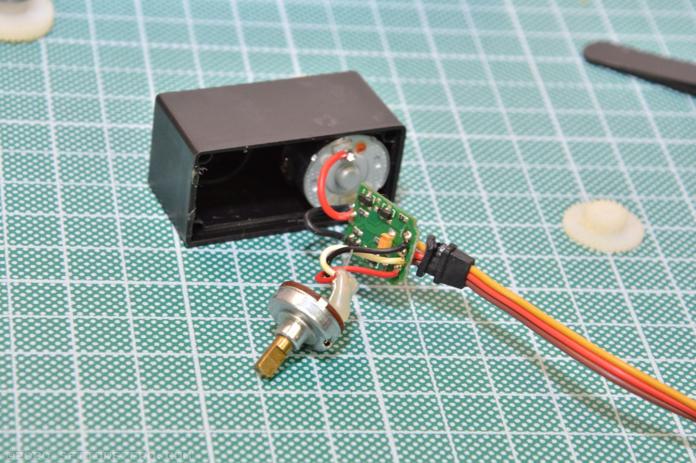

## Modifica servocomandi

Questa è una guida per eseguire la modifica di un normale servocomando RC in modo da trasformarlo in un servo a rotazione continua. Questa procedura **not è necessaria** se hai già un servo a 360°.  
[Qui c'è un video](https://www.youtube.com/watch?v=_Ubauj75d9E) che illustra questa procedura.

Materiale necessario:

- 4 resistenze 22KΩ ¼W 1%
- un piccolo bisturi/taglierino (se hai un servo con ingranaggi di plastica) o una pinza (se hai un servo con ingranaggi metallici)
- un piccolo cacciavite a croce
- saldatore
- aspirastagno

gira il servocomando dalla parte delle 4 viti di chiusura nella parte bassa:

Svita le viti:

Apri la scatola del servocomando:

Visualizza gli ingranaggi:

Estrai l'ingranaggio del mozzo e il cuscinetto a sfera su di esso:

Guarda questo ingraggio: ha un nottolino al di sopra, nei servo con ingranaggi metallici, come il MG996R, è metallico:

Quel nottolino serve a bloccare la rotazione continua dell'ingranaggio: bisogna rimuoverlo. Nei servo in plastica puoi tagliarlo con il bisturi (ma questa procedura non è reversibile!): fai con estrema cura senza applicare troppa forza altrimenti rischi di rompere l'ingranaggio!
Nei servo metallici il nottolino può essere estratto con una pinza dato che, generalmente, viene inserito a pressione in un foro:

Estrai il circuito stampato del servocomando:

Nella parte superiore del servocomando spunta fuori l'alberino del potenziometro: devi premerlo con delicatezza verso il basso per far fuoriuscire il potenziometro:

Devi avere PCB e potenziometro a portata di mano:

Dissalda i cavetti (o i terminali) del potenziometro:

Prendi le resistenze da 22KΩ 1% e arrangiale in questo modo:

Metti le resistenze nei pad che erano riservati al potenziometro. In questo modo il controller del potenziometro crederà che il servo si trova sempre in posizione centrale per cui non smetterà mai di far girare il motore (a meno che non gli inviamo il segnale di posizione centrale):

Rimonta il servo. Fai lo stesso con l'altro servo.
