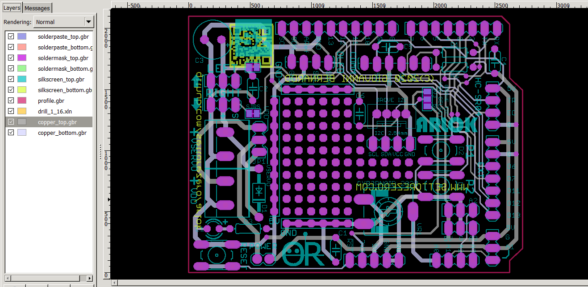

# Arlok PCB Gerbers
  
This folder contains gerber files for PCB manufacturing. You can preview them using a free Gerber Viewer such as [GerbV](http://gerbv.geda-project.org/).  
I advice you to let PCBWay make the PCBs for you since they already have those files, without the need for you to upload and set an order.

## How make ARLOK PCBs on PCBWay

- Register to PCBWay using [my refferer link](https://www.pcbway.com/setinvite.aspx?inviteid=355653&from=settorezero2020)
- Upon you registered, go to the [PCBWay ARLOK shared project page](https://www.pcbway.com/project/shareproject/ARLOK_arduino_robot.html)
- Click on "Add to Cart" button on the right
- A pop-up will show up: all default settings are good. You must only select how many PCBs you want: the minimum quantity, by default, is 5. The first order of 5 PCBs is free on PCBWay: you must pay only the shipping costs
