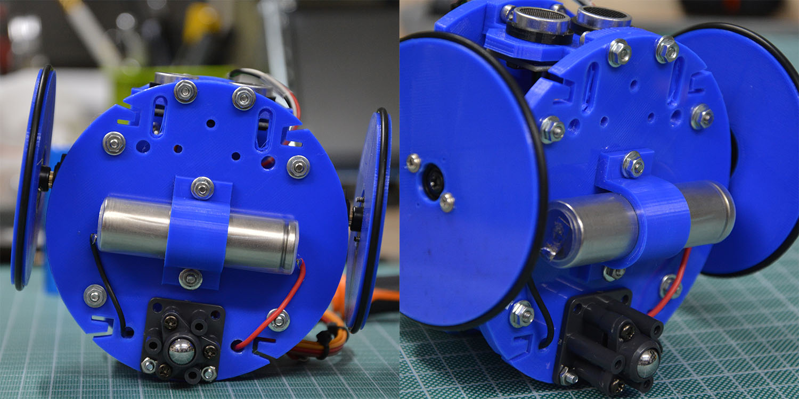
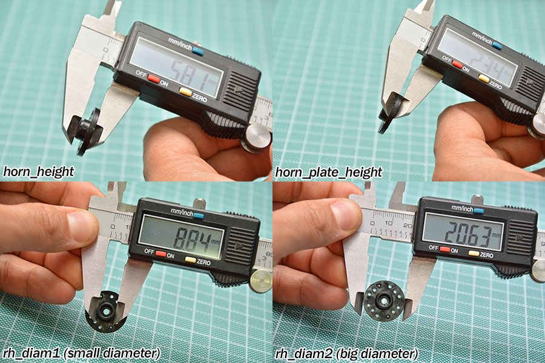

# Arlok 3D Files for 3d-Printing 
This folder contains parts to be 3D-printed.  I like to use the [Sunlu PLA+](https://amzn.to/3aG5V7i) filament.  
> Quick link to this page: [https://tinyurl.com/3dprintarlok](https://tinyurl.com/3dprintarlok)  

## Summary
+ [Printer settings](#printersettings)
+ [Main Parts](#mainparts) 
+ [Main Parts description and notes](#descriptions)
   1. [Plate bottom](#platebottom)
   2. [Plate top](#platetop)
   3. [Servo brackets](#servobrackets)
   4. [Sonar pillar](#sonarpillar)
   5. [Rear pillar](#rearpillar)
   6. [Wheels](#wheels)
   7. [Tires](#tires)
   8. [Via Pixetto support](#viapixetto)
   9. [18650 cell bracket](#18650)
+ [How customize the wheels](#customizewheels) 
+ [Moods](#moods)

## Printer settings
Values in the parts table are calculated using CURA slicer with following settings:

- Layer Height: 0.2mm
- Top Layers: 5
- Bottom Layers: 5
- Wall line count: 3
- Print speed: 30mm/sec
- Infill speed: 50mm/sec
- Travel speed: 65mm/sec
- Infill density: 20%
- Generate Support: NO
- Build plate adhesion type: skirt

I use those slow settings because I've a cheap 3D-Printer and I need to print slow. Also Infill maybe is slightly oversized since pieces are pretty big. If you've a good 3D-printer you can speed-up and lower the infill.

## Main Parts
You can see the [Arlok Exploded View](../media/arlok_3d_exploded.stl) for seeing how parts must be assembled.  
Part quantity in parenthesis indicates that this is an optional or an alternative part.  
Time and weight is reported for total parts if more than one is needed.

| Qt. | File                                                                     | Print Time (minutes) | Weight (grams)| Notes |
|-----|--------------------------------------------------------------------------|----------------------|---------------|-------|
|  1  | [Plate Bottom](arlok_plate_bottom.stl)                                   | 199 | 26 |  |
|  1  | [Plate Top](arlok_plate_top.stl)                                         | 216 | 30 |  |
|  2  | [Servo Bracket](arlok_servo_bracket.stl)                                 | 106 | 12 |  |
|  1  | [Sonar Pillar](arlok_pillar_sonar.stl)                                   |  48 |  6 |  |
| (1) | [Sonar Pillar (round variant)](arlok_pillar_sonar_(variant_rounded).stl) |  48 |  6 |  |
| (1) | [6mm hole Rear Pillar](arlok_pillar_hole_(variant_06mm).stl)             |  40 |  6 |  | 
|  1  | [10mm hole Rear Pillar](arlok_pillar_hole_(variant_10mm).stl)            |  40 |  5 |  |
| (1) | [12mm hole Rear Pillar](arlok_pillar_hole_(variant_12mm).stl)            |  40 |  5 |  |
|  2  | [Wheel](arlok_wheel.stl)                                                 | 178 | 28 |  |
| (2) | [Wheel - slotted holes](./wheels/arlok_wheel_slotted.stl)                         |     |    |  |
| (2) | [Wheel - 5-star](./wheels/arlok_wheel_star5.stl)                                  |     |    |  |
| (2) | [Wheel - 10-star](./wheels/arlok_wheel_star10.stl)                                |     |    |  |
| (2) | [Wheel - honeycomb](./wheels/arlok_wheel_honeycomb.stl)                           |     |    |  |
| (2) | [Tire - round profile](./tires/arlok_tire_round.stl)                             |     |    | See descriptions |
| (2) | [Tire - flat profile](./tires/arlok_tire_flat.stl)                               |     |    |  |
| (2) | [Tire - knurled](./tires/arlok_tire_knurled.stl)                                 |     |    |  |
| (1) | [Via Pixetto Support](arlok_via_pixetto_support.stl)                     |  53 |  6 |  |
| (1) | [18650 LiPo Holder](arlok_18650_holder.stl)                              |     |    |  |
| ( ) | [Moods](./moods/)                                                        |     |    |  |

Estimated total printing time for standard parts: 13H 7'  
Estimated total filament needed for standard parts: 107g (about 36meters)

## Main Parts description and notes

### Plate Bottom
Front side is the one with the arrow on top. On front side there are two slotted holes: they are used, eventually, for attaching the Cytron Makerline module used for the line follower example. Servos must be mounted on top placing them in the grooves and having the shaft towards the front.

### Plate Top
You'll mount the Maker UNO board on top using 4 8mm or 10mm spacers. The two lateral wings will hold the 4AA battery holder in place.

### Servo Brackets
Bracket to hold in place the 2 servos: there is no need to attach servo to the bracket with screws even there are holes (they're placed there only for reference).

### Sonar Pillar
There are 2 variants: the standard, having squared edges, and the one with rounded edges, print only one of these.

### Rear Pillar
There are 3 variants that differs for the hole diameter used for the switch that detaches the 4AA batteries of the servo power. Print only 1 of these. 6mm variant will be used for the classic lever switch. 10mm variant is used for the 10mm lock pushbuttons. 12mm variant is used for the 12mm lock pushbuttons sold by FuturaShop (see [BOM in the docs folder](../docs/BOM.md)).

### Wheels
There are various kind of wheels optimized to be used with the round horn that comes with the MG996R servo and for an O-ring (or provided tires to be 3D-printed) having an internal diameter of 70mm and a section of about 2 or 3mm. Wheels are sized for giving the correct balance of the robot using the Tamiya 70144 ball caster mounted in the 25mm variant. The wheels will be attached to the servo Horns using 2 self-tapping screws given with the servos. A rubber O-Ring or a provided tire (3D printed using a flexible material like TPU) will be applied to the wheel groove for giving grip. 

The are:  
- The first, original [Wheel](./wheels/arlok_wheel.stl), see the [How customize the standard wheel](#customizewheels) for further informations
- [Wheel - slotted holes](./wheels/arlok_wheel_slotted.stl) designed by @gbr1 ([picture](../media/misc/wheel_slotted.jpg))
- [wheel - 5-star pattern](./wheels/arlok_wheel_star5.stl) designed by @gbr1
- [wheel - 10-star pattern](./wheels/arlok_wheel_star10.stl) designed by @gbr1
- [Wheel - honeycomb pattern](./wheels/arlok_wheel_honeycomb.stl) designed by @gbr1

### <a name="tires">Tires
You can use an O-ring having an internal diameter of 70mm and a section of about 2 or 3mm or, if your printer can handle flexible filaments (like TPU), you can print one of those provided tires: 

- [Tire - round profile](./tires/arlok_tire_round.stl) designed by @rbonghi (picture [[1]](../media/misc/tire_round_01.jpg) [[2]](../media/misc/tire_round_02.jpg))
- [Tire - flat profile](./tires/arlok_tire_flat.stl) designed by @gbr1
- [Tire - knurled](./tires/arlok_tire_knurled-stl) designed by @Dario-Ciceri

>@rbonghi advices those settings for the tire:
>- Filament: TPU SainSmart
>- Infill Density: 5%
>- Infill pattern: Honeycomb
>- Retraction: Disabled
>- Temperature Nozzle: 235 - 230
>- Temperature Bed: 45 - 40

###  Via Pixetto support
This support is used for attaching a [Via Pixetto Ai Camera](https://pixetto.ai/) on top-front of Arlok. The support is a hinge made of 2 pieces: you must use a long M3 screw and a nut. In the STL there are also 4 small spacers used for distancing the camera from the base: you must use M2 screws and nuts. Sorry but Via Pixetto example is still not ready.

###  18650 LiPo Holder
This part is used for holding a 18650 cell battery on the bottom of the robot. The 18650 will be used alone, without the two AA battery holders. You can use a single 18650 attached to a DC/DC boost converter through the pushbutton switch mounted on the rear pillar. Use a 18650 having soldering tabs. 

>**!!! WARNING !!!**  
**LiPo batteries can be very dangerous so don't mount this kind of battery if Arlok will be used by a child!**
  
I've successfully used a 2A DC/DC boost converter based on the [SX1308](https://amzn.to/3y07eIX). Set the converter for giving 6V at output, then feed the 6V in the `VSERVO` screw terminal and put the `JP1` jumper in `VSERVO` position and leave ON the `POWER` jumper/switch on the PCB: the main power will be disconnected through the pushbutton on the rear pillar.  

The LiPo must not go under a certain voltage so you can feed the positive terminal of the LiPo battery directly in one free analog input (`A2` for example) for checking the battery voltage and stop the robot if voltage goes below 3.2V.  
  
With those modifications the logic will be powered at about 5.3V (the 6V from the boost converter will be scaled down of about 0.7V by the voltage drop caused by `D1` diode), so for checking analog voltages keep in mind that the value `1023` from the ADC will be equal to about 5.3V (measure the precise voltage on the 5V pads and make computations accordly).  
  
This picture shows how 18650 will be mounted on the bottom of Arlok (use 2x M3 12mm screws, 2x M3 nuts and 2x M3 washers):

For recharing the battery you can use a cheap module for LiPo Charging having battery protection (mandatory!), such as [this kind of module](https://amzn.to/3qjoea8) based on the `TP4056`. Module with protection are slightly larger of the ones without protection and have an additional IC on top: so be sure to buy the type having protection! It's not adviced include the battery charged on the robot: better solder two wires with crocodile-clamps on charging module and attach it to battery tabs having care robot is turned off.
  
The SX1308 module will be placed inside the robot since there is a lot of space where the 4xAA battery holder would be.  
   
If you experience some problems like reset of the Arduino, you can increase the `C3` value. If you experience bluetooth module reset, increase the value of C5 or put an electrolytic capacitor (mind the polarity in this case!).

Anyway this setting is still experimental, was not tested under all conditions.

## How customize the standard wheel
Wheels are generated with [Openscad](https://www.openscad.org/) using [Obijuan script](https://www.thingiverse.com/thing:19940) of the Servo Wheel on Thingiverse. You can found the script also on his [Github Repo for Miniskybot](https://github.com/Obijuan/Miniskybot/).   

Customizing wheel is useful only if you plan to use a different ball-caster that gives the robot a different clearance from the floor.  

In the Obijuan script you can customize all wheel parameters. I've generated the default wheels using following measures:  
- external (finished) diameter: 75mm
- height: 5mm
- horn diameter: 21mm. 

See the following image for understanding servo parameters in the openscad script:  

## Arlok Moods

_Arlok Moods_ was introduced first time along the Arlok first release with the only eyelashes for _Arlokka_. Now we've included a lot of other moods: they are very small parts to be 3D printed and attached on ultrasonic capsules for giving your Arlok an unique expression.   
  
Those parts are very useful also for keeping ultrasonic sensor in place. You can also combine different Arlok moods and attach up to 2 moods for each capsule: but in this case is better glue them together.

| File                                               | Description      | Colors adviced |
|----------------------------------------------------|------------------|----------------|
| [Eyelashes](./moods/mood_eyelashes.stl)            | Long eyelashes for giving Arlok a female or fashion aspect      | Black, Gold, Copper, Silver, White |
| [Eyebrows](./moods/mood_eyebrows.stl)                      | You may give Arlok a bad or sad expression by tilting those eyebrows | Black, Gold, Copper, Silver, White |
| [Thick Eyebrows](./moods/mood_eyebrows_thick.stl)              | Bigger centered eyebrows for make Arlok look unibrowed or to be used in combination with one above eyebrow for looking perplexed| Black | 
| [Cartoon](./moods/mood_cartoon.stl)                        | Print them in white color: they will give Arlok eyes like a cartoon. Print them in red color for making Arlok looks mad. | White, Red, Yellow, Lime |
| [Cartoon with eyebrows](./moods/mood_cartoon_eyebrows.stl) | As above but with a cut for giving bad/sad expression. |  White, Red, Yellow, Lime |
| [None](./moods/mood_none.stl)                              | Simple round discs for no expression and keeping capsules in place. Try to print them in a different color than chassis | Any |
| [Meme "Feel like a sir" - Hat](./moods/mood_sir_hat.stl) | Hat from "Feel like a sir" meme | Black |
| [Meme "Feel like a sir" - Monocle](./moods/mood_sir_monocle.stl) | Monocle from "Feel like a sir" meme | Golden/Black |
| [Meme "Feel like a sir" - Moustache](./moods/mood_sir_moustache.stl) | Moustache from "Feel like a sir" meme | Black |