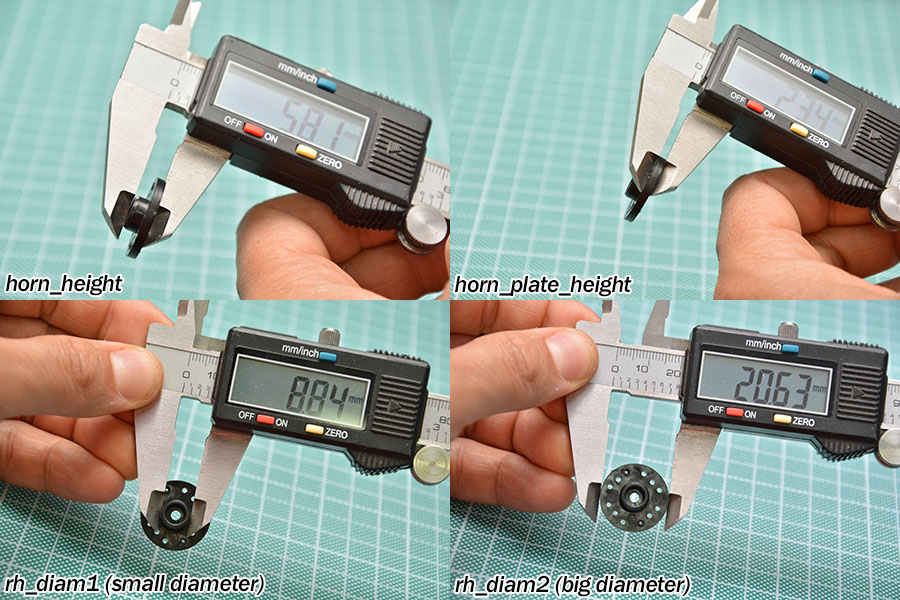

# Arlok 3D Files for 3d-Printing 
This folder contains parts to be 3D-printed. I Reccomended [Sunlu PLA+](https://amzn.to/3aG5V7i) filament.  

## Printer settings
- Infill: 25%
- Support: NO
- Layer Height: 0.1mm gives more accurate holes/slots

## Parts
You can see the [Exploded View](../images/arlok_3d_exploded.stl) for seeing how parts are assembled each other.  

- [Plate Bottom](arlok_plate_bottom.stl). Part where servo are attached on top and Ball Caster is mounted on bottom. The front part has 2 slotted holes used for line sensor mounting. Servo has to be mounted with the shaft towards the front. Servo slots are specifically designed for [MG996 Servo](https://www.futurashop.it/servo-analogico-11kg%E2%80%A2cm-015-s-55-g-ingranaggi-in-metallo-1606-MG996R?tracking=5f004a6ba8be7) but are pretty standard, so you can use every kind of standard servo (but the Multiplex and maybe other that have protrusions on the mounting tabs).
- [Plate Top](arlok_plate_top.stl). Top plate where [Maker UNO](https://www.futurashop.it/makeruno-1686-MAKERUNO?tracking=5f004a6ba8be7) has to be mounted. Front part has the ARLOK writing on top (and so the SETTOREZERO.COM writing is on the right)
- [Servo Braket](arlok_servo_bracket.stl). Print 2 of these. Are used to fix in place the 2 servomotors.
- [Sonar Pillar](arlok_pillar_sonar.stl). Used for HC-SR04 ultrasonic sonar. By printing using a 0.1 Layer I obtain a perfect sonar mounting without using screws or glue.
- [8mm hole Pillar](arlok_pillar_hole_08.stl). Print this if you want to use a classic lever switch for main power.
- [10mm hole Pillar](arlok_pillar_hole_10.stl). Print this if you want to use [10mm lock pushbuttons](https://amzn.to/31bjusa) for main power.
- [12mm hole Pillar](arlok_pillar_hole_12.stl). Print this if you want to use [12mm lock pushbuttons](https://www.futurashop.it/mini-interruttore-pulsante-rosso-2846-ch32037?tracking=5f004a6ba8be7) for main power.
- [Eyelashes](arlok_eyelashes.stl). Those are designed to give Arlok a female look (we call she _ARLOKKA_) by attaching them on the Ultrasonic sensor capsules.
- [Via Pixetto Support](arlok_via_pixetto_support.stl). This support is used for attaching a [Via Pixetto Ai Camera](https://pixetto.ai/) on top/front of ARLOK. The support is a hinge made of 2 pieces: you must use a long M3 screw and a nut. In the STL there are also 4 small spacers used for distancing the camera from the base: you must use M2 screws and nuts

## Wheel and Ball-Caster 
An O-Ring will be applied to the wheel for giving grip. The wheels will be attached to the servo Horns.  
The [Wheel](arlok_wheel.stl) is optimized to be used with the round horn that comes with the MG996 servo and for an o-ring having an internal diameter of 70-71mm and a section of about 2mm. Wheels are generated with [Openscad](https://www.openscad.org/) using [Obijuan script](https://www.thingiverse.com/thing:19940) of the Servo Wheel on Thingiverse. You can found the script also on his [Github Repo for Miniskybot](https://github.com/Obijuan/Miniskybot/). 

In the script you can customize all wheel parameters. I've generated the provided wheels with following measures: 
- external (finished) diameter: 75mm
- height: 5mm
- horn diameter: 21mm. 

See the following image for understanding servo parameters in the openscad script:  

  

A Tamiya 70144 ball-caster is used as third foothold. Ball caster will be mounted in the 27mm height version but without the M1 washers, so the total height of the ball caster will be 25mm.

## About Models
Arduino model, used for sizing and holes, is from [cmspooner on Thingiverse](https://www.openscad.org/)
