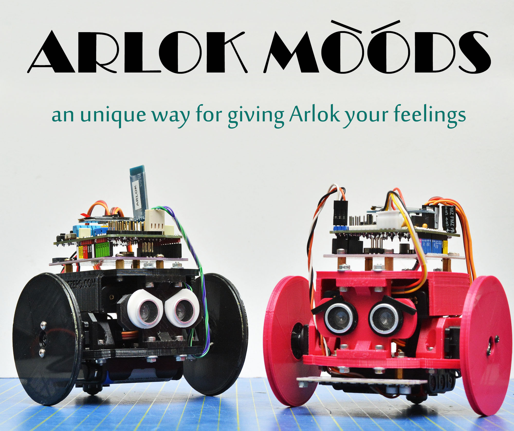

# Arlok 3D Files for 3d-Printing 
This folder contains parts to be 3D-printed.  I like to use the [Sunlu PLA+](https://amzn.to/3aG5V7i) filament.  
> Quick link to this page: [https://tinyurl.com/3dprintarlok](https://tinyurl.com/3dprintarlok)  

## Summary
+ [Printer settings](#printersettings)
+ [Main Parts](#mainparts) 
+ [Main Parts description and notes](#descriptions)
   1. [Plate bottom](#platebottom)
   2. [Plate top](#platetop)
   3. [Servo brackets](#servobrackets)
   4. [Sonar pillar](#sonarpillar)
   5. [Rear pillar](#rearpillar)
   6. [Wheels](#wheels)
   7. [Via Pixetto support](#viapixetto)
   8. [Printable Tires](#tires)
+ [How customize the wheels](#customizewheels) 
+ [Arlok Moods](#moods)

## Printer settings
Values in the parts table are calculated using CURA slicer with following settings:

- Layer Height: 0.2mm
- Top Layers: 5
- Bottom Layers: 5
- Wall line count: 3
- Print speed: 30mm/sec
- Infill speed: 50mm/sec
- Travel speed: 65mm/sec
- Infill density: 20%
- Generate Support: NO
- Build plate adhesion type: skirt

I use those slow settings because I've a cheap 3D-Printer and I need to print slow. Also Infill maybe is slightly oversized since pieces are pretty big. If you've a good 3D-printer you can speed-up and lower the infill.

## Main Parts
You can see the [Arlok Exploded View](../media/arlok_3d_exploded.stl) for seeing how parts must be assembled.  
Part quantity in parenthesis indicates that this is an optional or an alternative part.  
Time and weight is reported for total parts if more than one is needed.

| Qt. | File                                                                     | Print Time (minutes) | Weight (grams)| Notes |
|-----|--------------------------------------------------------------------------|----------------------|---------------|-------|
|  1  | [Plate Bottom](arlok_plate_bottom.stl)                                   | 199 | 26 |  |
|  1  | [Plate Top](arlok_plate_top.stl)                                         | 216 | 30 |  |
|  2  | [Servo Bracket](arlok_servo_bracket.stl)                                 | 106 | 12 |  |
|  1  | [Sonar Pillar](arlok_pillar_sonar.stl)                                   |  48 |  6 |  |
| (1) | [Sonar Pillar (round variant)](arlok_pillar_sonar_(variant_rounded).stl) |  48 |  6 |  |
| (1) | [6mm hole Rear Pillar](arlok_pillar_hole_(variant_06mm).stl)             |  40 |  6 |  | 
|  1  | [10mm hole Rear Pillar](arlok_pillar_hole_(variant_10mm).stl)            |  40 |  5 |  |
| (1) | [12mm hole Rear Pillar](arlok_pillar_hole_(variant_12mm).stl)            |  40 |  5 |  |
|  2  | [Standard Wheel](arlok_wheel.stl)                                        | 178 | 28 |  |
| (1) | [Via Pixetto Support](arlok_via_pixetto_support.stl)                     |  53 |  6 |  |
| (2) | [Wheel O-Ring by Raffaello Bonghi](arlok_tire.stl)                      |     |    | See descriptions |

Estimated total printing time for standard parts: 13H 7'  
Estimated total filament needed for standard parts: 107g (about 36meters)

## Main Parts description and notes

#### Plate Bottom
Front side is the one with the arrow on top. On front side there are two slotted holes: they are used, eventually, for attaching the Cytron Makerline module used for the line follower example. Servos must be mounted on top placing them in the grooves and having the shaft towards the front.

#### Plate Top
You'll mount the Maker UNO board on top using 4 8mm or 10mm spacers. The two lateral wings will hold the 4AA battery holder in place.

#### Servo Brackets
Bracket to hold in place the 2 servos: there is no need to attach servo to the bracket with screws even there are holes (they're placed there only for reference).

#### Sonar Pillar
There are 2 variants: the standard, having squared edges, and the one with rounded edges, print only one of these.

#### Rear Pillar
There are 3 variants that differs for the hole diameter used for the switch that detaches the 4AA batteries of the servo power. Print only 1 of these. 6mm variant will be used for the classic lever switch. 10mm variant is used for the 10mm lock pushbuttons. 12mm variant is used for the 12mm lock pushbuttons sold by FuturaShop (see [BOM in the docs folder](../docs/BOM.md)).

#### Wheels
The [Wheel](arlok_wheel.stl) is optimized to be used with the round horn that comes with the MG996 servo and for an o-ring having an internal diameter of 70mm and a section of about 2 or 3mm. A rubber O-Ring will be applied to the wheel groove for giving grip. Please don't use cyanoacrilate glue for attaching the O-Ring. The wheels will be attached to the servo Horns using 2 self-tapping screws given with the servos. Wheel is sized for giving the correct balance of the robot using the Tamiya 70144 ball caster mounted in the 27mm variant without H1 washers (so the total height of the ball caster will be 25mm).

####  Via Pixetto support
This support is used for attaching a [Via Pixetto Ai Camera](https://pixetto.ai/) on top-front of ARLOK. The support is a hinge made of 2 pieces: you must use a long M3 screw and a nut. In the STL there are also 4 small spacers used for distancing the camera from the base: you must use M2 screws and nuts. Sorry but Via Pixetto example is still not ready.

#### <a name="tires">Printable Tires (by Raffaello Bonghi)
If your 3D-Printer can handle TPU (flexibile filament) you can print 2 copies of this stl instead buying an O-Ring. This part was contributed by @rbonghi. You can see some pictures of this O-Ring [here](../media/tires_rbonghi/).  
Raffaello advices those settings:
- Filament: TPU SainSmart
- Infill Density: 5%
- Infill pattern: Honeycomb
- Retraction: Disabled
- Temperature Nozzle: 235 - 230
- Temperature Bed: 45 - 40

## How customize the wheels
Wheels are generated with [Openscad](https://www.openscad.org/) using [Obijuan script](https://www.thingiverse.com/thing:19940) of the Servo Wheel on Thingiverse. You can found the script also on his [Github Repo for Miniskybot](https://github.com/Obijuan/Miniskybot/).   

Customizing wheel is useful only if you plan to use a different ball-caster that gives the robot a different clearance from the floor.  

In the Obijuan script you can customize all wheel parameters. I've generated the default wheels using following measures:  
- external (finished) diameter: 75mm
- height: 5mm
- horn diameter: 21mm. 

See the following image for understanding servo parameters in the openscad script:  

## Arlok Moods

_Arlok Moods_ was introduced first time along the Arlok first release with the only eyelashes for _Arlokka_. Now we've included a lot of other moods: they are very small parts to be 3D printed and attached on ultrasonic capsules for giving your Arlok an unique expression.   
  
Those parts are very useful also for keeping ultrasonic sensor in place. You can also combine different Arlok moods and attach up to 2 moods for each capsule: but in this case is better glue them together.

| File                                               | Description      | Colors adviced |
|----------------------------------------------------|------------------|----------------|
| [Eyelashes](./moods/mood_eyelashes.stl)            | Long eyelashes for giving Arlok a female or fashion aspect      | Black, Gold, Copper, Silver, White |
| [Eyebrows](./moods/mood_eyebrows.stl)                      | You may give Arlok a bad or sad expression by tilting those eyebrows | Black, Gold, Copper, Silver, White |
| [Thick Eyebrows](./moods/mood_eyebrows_thick)              | Bigger centered eyebrows for make Arlok look unibrowed or to be used in combination with one above eyebrow for looking perplexed| Black | 
| [Cartoon](./moods/mood_cartoon.stl)                        | Print them in white color: they will give Arlok eyes like a cartoon. Print them in red color for making Arlok looks mad. | White, Red, Yellow, Lime |
| [Cartoon with eyebrows](./moods/mood_cartoon_eyebrows.stl) | As above but with a cut for giving bad/sad expression. |  White, Red, Yellow, Lime |
| [None](./moods/mood_none.stl)                              | Simple round discs for no expression and keeping capsules in place. Try to print them in a different color than chassis | Any |